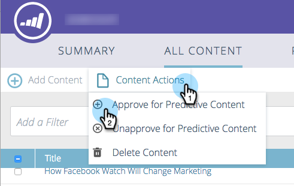

# 批准预测内容的标题 {#approve-a-title-for-predictive-content}

您可以在“所有内容”页面或“编辑内容”弹出窗口中批准预测内容，从而将“所有内容”页面上的任何标题添加到预测内容。

## 所有内容页面 {#all-content-page}

1. 选中内容旁边的框。

   

1. 单击 **内容操作** 下拉菜单并选择 **批准预测内容**.

   

## 编辑内容弹出窗口 {#edit-content-pop-up}

您还可以直接在“编辑内容”弹出窗口中批准预测内容的标题。

1. 将鼠标悬停在某个内容上，然后单击行末尾的编辑图标。

   

1. 查看 **批准预测内容** 框，然后单击 **保存**.

   

无论您使用哪种方式，批准预测内容图标现在都将显示在行中。

现在，您可以看到“预测内容”页面上显示的标题。

