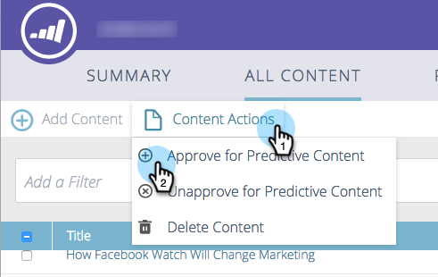
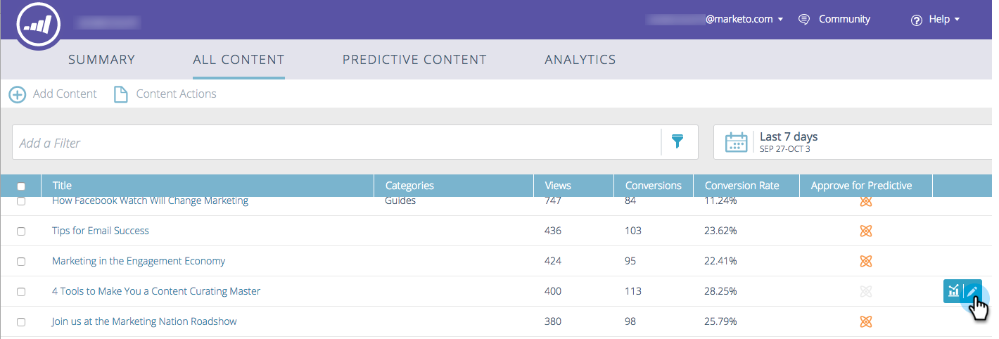
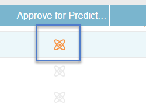

# 批准预测性内容标题 {#approve-a-title-for-predictive-content}

您可以在[!UICONTROL All Content]页面或[!UICONTROL Edit Content]弹出窗口中批准[!UICONTROL All Content]页面上的任何标题，以将其添加到预测内容。

## [!UICONTROL All Content]页 {#all-content-page}

1. 选中内容旁边的框。

   

1. 点击 **[!UICONTROL Content Actions]** 下拉菜单，并选择 **[!UICONTROL Approve for Predictive Content]**。

   

## [!UICONTROL Edit Content]弹出窗口 {#edit-content-pop-up}

您还可以直接在[!UICONTROL Edit Content]弹出窗口中批准预测内容的标题。

1. 将鼠标悬停在某个内容上，然后单击行末的编辑图标。

   

1. 在[!UICONTROL Edit Content]弹出窗口中选中&#x200B;**[!UICONTROL Approve for Predictive Content]**&#x200B;框并单击&#x200B;**[!UICONTROL Save]**。

   

无论您使用哪种方式，[!UICONTROL Approve for Predictive Content]图标现在都显示在行中。

您现在可以看到[!UICONTROL Predictive Content]页面上显示的标题。

