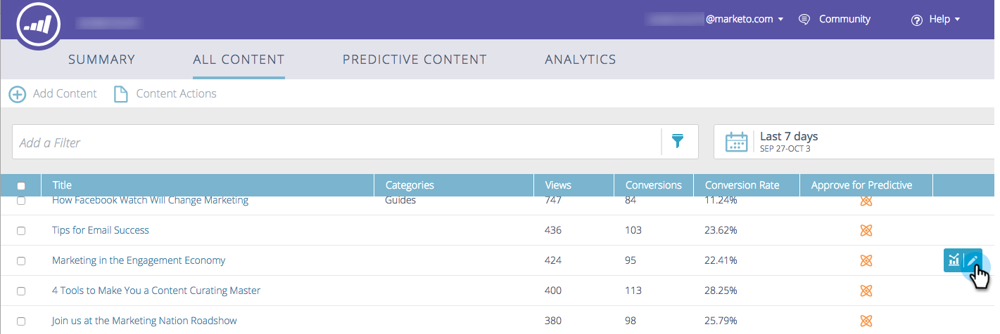

# 编辑内容 {#edit-content}

您可以对“所有内容”页面上的列表进行一些编辑。

1. 在 **所有内容** ，将鼠标悬停在要编辑的标题行上，然后单击编辑图标。

   

1. 更改内容标题和内容URL（查询参数复选框是可选的）。

   

1. 单击 **类别** 字段来添加/删除类别。 从下拉列表中选择新受众。 您可以通过单击当前选定的类别 **X**.

   

1. 检查 **批准预测内容** 复选框，或取消选中要取消批准的框。 单击 **保存** 完成时。

   
