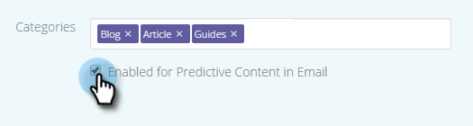

# 编辑电子邮件的预测内容 {#edit-predictive-content-for-emails}

以下是如何为电子邮件设置预测内容。

>[!PREREQUISITES]
>
>内容必须为 [已批准预测内容](/help/marketo/product-docs/predictive-content/working-with-all-content/approve-a-title-for-predictive-content.md) （在“所有内容”页面上）。

1. 在“预测内容”页面上，单击标题以打开编辑器。

   

1. 此时将打开编辑页面。 **电子邮件** 默认显示。

   

   >[!NOTE]
   >
   >标题和URL已被填充。 确认他们是你想要的。

1. 要添加/编辑按钮标签，请在其右侧的文本框中键入。

   

   >[!NOTE]
   >
   >如果更改了按钮标签，则在保存更改或预览图像时，该按钮标签会更新。

1. 要添加或编辑图像URL，请单击 **编辑图像**.

   

   >[!CAUTION]
   >
   >要确保最佳质量，图像必须为400x400像素或更小。

1. 插入图像URL并单击 **添加**.

   

1. 单击并拖动滑块以更改图像大小。 然后，单击并拖动裁剪框以隔离您要使用的所需图像区域。 单击 **预览** 完成时。

   

1. 单击侧边的箭头以滚动浏览并在每个电子邮件布局预览中查看您的内容（显示两个选项）。

   |  |  |
   |---|---|

1. （可选）单击 **类别** 字段，并向内容中添加类别。 选项来自 [已设置的类别](/help/marketo/product-docs/predictive-content/getting-started/set-up-categories.md).

   

1. 选中方框以在电子邮件中启用预测内容。

   

1. 单击 **保存**.

   

   >[!NOTE]
   >
   >在Marketo Email Editor v2.0中，您还可以 [查看布局模板](/help/marketo/product-docs/predictive-content/enabling-predictive-content/enable-predictive-content-in-emails.md) 在启用内容时使用。
