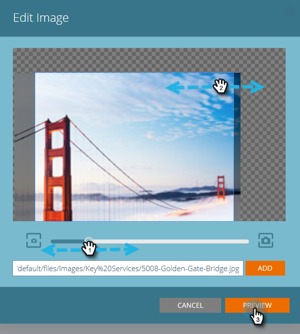

# 编辑电子邮件的预测内容 {#edit-predictive-content-for-emails}

下面是如何为电子邮件设置预测内容的。

>[!PREREQUISITES]
>
>内容必须为 [已批准预测内容](/help/marketo/product-docs/predictive-content/working-with-all-content/approve-a-title-for-predictive-content.md) （在所有内容页面上）。

1. 在“预测内容”页面上，单击标题以打开编辑器。

   

1. 编辑页面将打开。 **电子邮件** 默认显示。

   

   >[!NOTE]
   >
   >标题和URL已填充。 确认它们符合您的要求。

1. 要添加/编辑按钮标签，请在其右侧的文本框中键入。

   

   >[!NOTE]
   >
   >如果更改了按钮标签，则在保存更改或预览图像时，按钮标签将会更新。

1. 要添加或编辑图像URL，请单击 **编辑图像**.

   

   >[!CAUTION]
   >
   >为确保最佳质量，图像必须等于或小于400x400像素。

1. 插入图像URL并单击 **添加**.

   

1. 单击并拖动滑块可更改图像大小。 然后单击并拖动裁剪框以隔离要使用的所需图像区域。 单击 **预览** 完成时。

   

1. 单击两侧的箭头可在每个电子邮件布局预览中滚动浏览并查看您的内容（显示两个选项）。

   |  |  |
   |---|---|

1. （可选）单击 **类别** 字段并将类别添加到内容中。 选项来自 [您已设置的类别](/help/marketo/product-docs/predictive-content/getting-started/set-up-categories.md).

   

1. 选中方框，可在电子邮件中启用预测内容。

   

1. 单击 **保存**.

   

   >[!NOTE]
   >
   >在Marketo电子邮件编辑器v2.0中，您还可以 [查看布局模板](/help/marketo/product-docs/predictive-content/enabling-predictive-content/enable-predictive-content-in-emails.md) 在启用内容时，您会使用。
