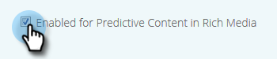

# 编辑富媒体的预测内容{#edit-predictive-content-for-rich-media}

下面介绍如何为富媒体设置预测内容。

>[!PREREQUISITES]
>
>“所有内容”页面上的预测内容](/help/marketo/product-docs/predictive-content/working-with-all-content/approve-a-title-for-predictive-content.md)必须批准[。

1. 在&#x200B;**预测内容**&#x200B;页面上，单击标题以打开编辑器。

   

1. 单击&#x200B;**富媒体**。

   

1. 您会注意到您可以为电子邮件和富媒体提供单独的图像。 要添加/更改图像，请将图像URL粘贴到其文本框中。

   

1. 键入&#x200B;**Description**。

   

1. 单击&#x200B;**类别**&#x200B;框以选择/添加已设置](/help/marketo/product-docs/predictive-content/getting-started/set-up-categories.md)的[类别（可选）。

   

   >[!NOTE]
   >
   >使用类别对特定富媒体推荐模板的内容进行分组。 将类别留空，以将内容应用于所有推荐模板（建议）。
   >
   >但是，如果只想为富媒体模板推荐特定内容，请为该内容添加类别，并将该类别与推荐模板关联。
   >
   >例如，根据网站的各个部分（产品或解决方案）对相关内容进行分类。

1. 选中此框可在富媒体中启用预测内容。

   

1. 单击&#x200B;**保存**。

   
