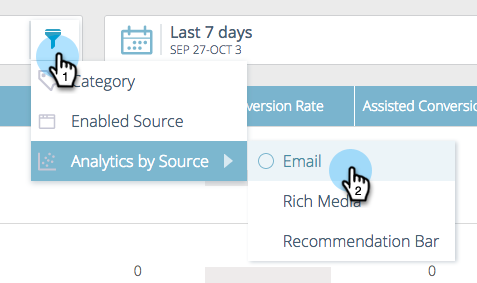

# 了解预测内容 {#understanding-predictive-content}

在您之后 [批准预测内容的标题](/help/marketo/product-docs/predictive-content/working-with-all-content/approve-a-title-for-predictive-content.md)，您在此处处理。 “预测内容”页面会显示您已批准用于预测内容的所有标题。

页面字段包括：

* **图像和标题**：内容段和选定图像的名称
* **由源启用**：显示标题是否已被批准用于富媒体、电子邮件或推荐栏。
* **类别**：由您创建，用于对Web或电子邮件的预测结果进行分组
* **点击次数**：推荐内容（包括所有源）的总点击次数
* **转化率**：由直接转化除以点击量计算的百分比。 将鼠标悬停在上面可查看其他数据（请参阅下文）
* **辅助转化**：在上次访问中单击了推荐内容并在稍后完成表单的访客

## 筛选内容 {#filtering-content}

**类别**

您可以按已创建的类别筛选内容。 单击过滤器图标，然后在 **类别**&#x200B;中，选择一个或多个内容类别。

**启用的源**

按每种类型的已启用内容进行筛选：电子邮件、富媒体、推荐栏。

**按源分析**

通过筛选启用的内容分析，您可以查看每个源的执行情况。

## 按日期显示Analytics {#display-analytics-by-date}

1. 选择右侧的开始日期和结束日期（如图所示）。 单击 **应用**.

   

## 查看预测内容的表数据 {#view-table-data-for-predictive-content}

在表中，您可以按从左到右的顺序查看为预测内容启用的源：推荐栏、电子邮件和富媒体。 启用的源以绿色显示。 您可以在编辑内容时启用这些项。

将鼠标悬停在“转化率”列中的栏上，可以查看转化率、直接转化和点击数据。

>[!NOTE]
>
>**定义**
>
>**转化率**：由直接转化除以点击量计算的百分比
>
>**直接转化**：在同一次访问中点击推荐内容并完成表单的访客
>
>**已单击**：推荐内容的总点击次数（包括所有三个源）
