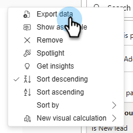

# 高级BI Analytics概述 {#advanced-bi-analytics-overview}

Advanced BI Analytics(以前称为Revenue Explorer和Advanced Report Builder)提供了有关Marketo Engage数据的灵活报表和可视化界面，提供了有关进度、性能等内容的精细详细信息。 它具有更丰富的交互性和可视化功能、更快的性能以及更顺畅和直观的用户体验。

这些增强功能可帮助您节省时间、发现更有价值的见解、推动优化，并与同事和利益相关者分享更有说服力的数据故事。

>[!PREREQUISITES]
>
>要访问此功能，您必须已购买高级BI Analytics加载项。 有关详细信息，请联系Adobe客户团队（您的客户经理）。

## 主要功能和优势 {#key-features-and-benefits}

* **高性能查询引擎**：在大型数据集上的性能提升了5倍，从而加快数据处理速度、加快报告加载速度，并提供更流畅的分析体验。

* **丰富且引人注目的可视化图表**：包含图表、地图和KPI指标在内的一系列内置可视化图表选项进行了大量扩展，使功能板更具洞察力和影响力，并显着提升数据故事讲述能力。

* **高级交互性和动态筛选**：跨可视化应用动态切片器、交叉筛选和相互依赖的筛选器。 多页报表支持高级向下钻取、向上钻取和穿透钻取，从而确保轻松地探索数据。

* **直观的报表创作界面**：点击式体验简化了报表创建过程，包括多页面穿透钻取报表。 该界面允许用户设计复杂的交互式报表，而无需具备深厚的技术专业知识。

* **轻松共享，包括PowerPoint导出**：内置共享功能使共享见解变得轻而易举。 除其他目标外，用户还可以轻松地生成演示就绪的PowerPoint幻灯片。

## 创建报告 {#create-a-report}

1. 在“我的Marketo”中，单击&#x200B;**[!UICONTROL Advanced BI Analytics]**&#x200B;磁贴。

   {width="800" zoomable="yes"}

1. 在&#x200B;**[!UICONTROL Reports]**&#x200B;选项卡中，单击&#x200B;**[!UICONTROL Create Report]**。

   {width="800" zoomable="yes"}

1. 选择所需的度量。

   {width="800" zoomable="yes"}

1. 选择所需的尺寸。

   {width="800" zoomable="yes"}

1. 选择您的首选可视化图表。

   {width="800" zoomable="yes"}

1. 通过拖放维度属性来添加过滤器。

   {width="800" zoomable="yes"}

## 导出报告 {#export-a-report}

导出完整报表时，您的导出选项为PDF和PPT。 如果您需要.XLS或.CSV格式的数据，可以通过导出单个可视化图表来执行此操作（[请参阅下面的](#export-a-visualization)）。

>[!BEGINTABS]
>[!TAB 从报告页面] 

1. 在“报告”页面上，单击所需报告的“更多”图标(...)，然后选择&#x200B;**导出**。

   

1. 选择PDF或PPT，然后单击&#x200B;**导出**。

   

>[!TAB 在报表中]

1. 在报表中，单击右上角的“更多”图标(**...**)，然后选择&#x200B;**导出**。

   

1. 选择PDF或PPT，然后单击&#x200B;**导出**。

   

>[!ENDTABS]

### 导出可视化图表 {#export-a-visualization}

了解如何导出报告的特定部分。

1. 选择所需的报表。

   {width="600" zoomable="yes"}

1. 将鼠标悬停在显示的可视化图表上以显示三个图标。

   {width="600" zoomable="yes"}

1. 单击“更多”图标(**...**)

   

1. 选择&#x200B;**导出数据**。

   

1. 选择所需的数据格式。

   

   >[!NOTE]
   >
   >* _当前布局为_&#x200B;的数据仅适用于表和矩阵可视化图表。
   >* _基础数据_&#x200B;在Marketo Engage中不可用。

1. 选择所需的文件格式(.XLS、.CSV)。

   

1. 单击&#x200B;**导出**。

## 视频演示 {#video}

观看以下视频，了解多页面、穿透钻取报表体验的示例。

>[!VIDEO](https://video.tv.adobe.com/v/3451692/?quality=12&learn=on&captions=chi_hans){transcript=true}

## 高级BI Analytics中的标准报表 {#standard-reports}

以下标准报表作为示例包含在自定义报表中。

<table>
  <thead>
    <tr>
      <th>报告区域</th>
      <th>报告名称</th>
    </tr>
  </thead>
  <tbody>
    <tr>
      <td rowspan="8">电子邮件分析</td>
      <td>电子邮件 — 已发送活动(CST)</td>
    </tr>
    <tr>
      <td>电子邮件 — 点击活动(CST)</td>
    </tr>
    <tr>
      <td>电子邮件 — 打开活动(CST)</td>
    </tr>
    <tr>
      <td>电子邮件 — 点击时间分布(CST)</td>
    </tr>
    <tr>
      <td>电子邮件 — 打开率衰减</td>
    </tr>
    <tr>
      <td>电子邮件 — 打开时间分布(CST)</td>
    </tr>
    <tr>
      <td>电子邮件 — 性能详细信息</td>
    </tr>
    <tr>
      <td>电子邮件 — 点击率衰减</td>
    </tr>
    <tr>
      <td rowspan="8">商机分析</td>
      <td>按已转化商机列出的前10个商机来源</td>
    </tr>
    <tr>
      <td>前10个潜在客户来源</td>
    </tr>
    <tr>
      <td>SLA违规报表</td>
    </tr>
    <tr>
      <td>潜在客户帐龄报表</td>
    </tr>
    <tr>
      <td>商机余额报表</td>
    </tr>
    <tr>
      <td>潜在客户转化报表</td>
    </tr>
    <tr>
      <td>商机流量报表</td>
    </tr>
    <tr>
      <td>提前期过渡时间报表</td>
    </tr>
    <tr>
      <td rowspan="5">项目分析</td>
      <td>10大成功计划</td>
    </tr>
    <tr>
      <td>按总管道列出的10大项目</td>
    </tr>
    <tr>
      <td>项目群收入阶段报表</td>
    </tr>
    <tr>
      <td>前10大客户获取计划</td>
    </tr>
    <tr>
      <td>营销渠道投资趋势</td>
    </tr>
    <tr>
      <td rowspan="7">机会分析</td>
      <td>对已结束的机会的营销影响</td>
    </tr>
    <tr>
      <td>营销对成功的机会的影响</td>
    </tr>
    <tr>
      <td>营销对所创建机会的影响</td>
    </tr>
    <tr>
      <td>(FT)营销对所创造机会的影响</td>
    </tr>
    <tr>
      <td>(MT)营销对成功的机会的影响力</td>
    </tr>
    <tr>
      <td>(MT)营销对创造的机遇的影响</td>
    </tr>
    <tr>
      <td>(FT)营销对成功的机会的影响</td>
    </tr>
    <tr>
      <td>商机潜在客户分析</td>
      <td>按成功的机会列出的前10位潜在客户责任人</td>
    </tr>
  </tbody>
</table>

## 注意事项 {#note}

* 经典“Revenue Explorer”体验将于2025年6月10日永久弃用。 同时，您可以访问、创建、更新和删除两个体验中的报告。

* 您的自定义报告将通过以下[学习新体验](#learning-the-new-experience)部分中提到的显着行为更改，从经典体验复制到新体验。

  >[!IMPORTANT]
  >
  >自定义报表的复制将以组形式执行。 将自定义报表复制到新Experience中后，为确保两个体验之间的一致性，经典体验中所做的任何更改还需要手动应用到新Experience中的相应报表。 在复制客户报告后，上述信息备注将在经典Experience中显示。

   * 经典体验中的仪表板不可传输，并且需要在新体验中进行重新创建。 它们应该重新创建，因为新体验中的报告和新体验中的过滤器会自动提取可能的值，而不是要求您在传统体验中单独手动输入所有可能的值。

     >[!NOTE]
     >
     >新版Experience中的功能板只是单个页面上的报表集合。 新版Experience中仪表板的主要价值在于，允许您跨不同的报告区域提供分析见解。

* 您在经典Experience中的电子邮件订阅将被复制到新Experience。 经典体验中的电子邮件订阅将继续正常运行，直到经典体验在2025年6月10日弃用。

* 现有Revenue Explorer用户自动拥有对新的高级BI Analytics体验的访问权限。

* 您可以在高级BI Analytics中创建&#x200B;**最多700个报表**。

  >[!NOTE]
  >
  >如果您在Revenue Explorer中有700多个报表，则某些报表已与其他报表合并，并通过报表中的页面进行了合并。
  >
  >* 如果报表具有电子邮件订阅，则不会合并该报表。
  >
  >* _同一文件夹_&#x200B;中的其余报告按报告区域合并为一个或多个报告。 如果报告领域有五份以上的报告，则合并为一个以上的合并报告。
  >
  >* 每个合并报表不超过5页。

* 对于任何给定的可视化图表，每个查询有100万行的限制。 如果查询超过此值，您将收到以下错误： `The resultset of a query to external data source has exceeded the maximum allowed size of '1000000' rows`。 要解决此问题，请缩小日期范围，和/或调整报表中的过滤器以减少查询结果中的行数。

## 了解新体验 {#learning-the-new-experience}

新的可视化体验通过嵌入式Power BI服务提供。

有关可视化体验的快速教程，请访问Microsoft的[在Power BI中使用可视化图表](https://learn.microsoft.com/en-us/training/modules/visuals-in-power-bi/){target="_blank"}文档。 请注意，您可能不会在Marketo Engage中看到所有这些功能。

### 显着体验更改 {#notable-experience-changes}

以下是新体验（高级BI Analytics）相对于经典体验(收入资源管理器/高级Report Builder)所做的更改。

* 日期类型筛选器的功能是等效的；但是，指定值的语法发生了变化。 在现有的自定义报表中，除“每周时间”之外的所有日期类型筛选器值都会自动转换为新Experience中对应的等效值。 已停止对“每周时间”值的支持。

* 字符串类型过滤器现在区分大小写。

* 经典Experience中的运行时公式字段不再受支持。

* 电子邮件订阅包括PDF导出，而不是报表的HTML。 新的电子邮件订阅将不包含报告定义。

* 目前不支持报告的深层链接。

* 与在classic experience中异步导出相比，在new experience中，PDF导出是同步的。

>[!NOTE]
>
>无法在Visual for Model Performance Analysis （潜在客户）报告区域中包含多个自定义字段组字段。

>[!MORELIKETHIS]
>
>[指标和维度](/help/marketo/product-docs/reporting/advanced-bi-analytics/metrics-and-dimensions.md){target="_blank"}
