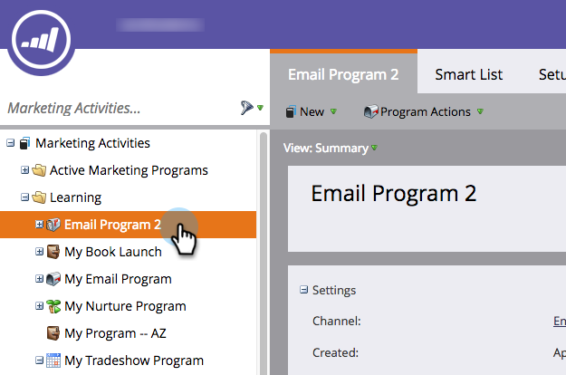

# 在项目群中创建报告 {#create-a-report-in-a-program}

运行报表以分析人员、程序、登陆页面、电子邮件和社交资产。

1. 转到 **营销活动**.

   

1. 选择一个项目。

   

   >[!NOTE]
   >
   >您还可以从以下位置创建报告 **分析** 选项卡。

1. 右键单击项目并选择 **新建本地资产**.

   

1. 单击 **报告**.

   

1. 选择报告 **类型**.

   

   >[!TIP]
   >
   >参见 [报表类型概述](https://docs.marketo.com/display/DOCS/Report+Type+Overview) ，以了解每种体验的简短说明。

1. 为您的报告命名。

   

   >[!TIP]
   >
   >为了便于以后导航报表，请在名称中包含对报表类型的引用。

1. 设置报告的时间范围。 参见 [更改报表时间范围](/help/marketo/product-docs/reporting/basic-reporting/editing-reports/change-a-report-time-frame.md) 了解更多详细信息。

1. 单击 **报告** 选项卡以查看统计信息。

   

   >[!NOTE]
   >
   >默认情况下，报表会涵盖您帐户中跨项目的所有活动。

   >[!NOTE]
   >
   >您很快就会收到许多报告。 请记住 [删除报告](/help/marketo/product-docs/reporting/basic-reporting/report-activity/delete-a-report.md) 你不再需要。

   >[!MORELIKETHIS]
   >
   >您可以 [更改报告时间范围](/help/marketo/product-docs/reporting/basic-reporting/editing-reports/change-a-report-time-frame.md)， [订阅基本报表](/help/marketo/product-docs/reporting/basic-reporting/report-subscriptions/subscribe-to-a-basic-report.md)， [将报表导出到Excel](/help/marketo/product-docs/reporting/basic-reporting/report-activity/export-a-report-to-excel.md)， [使用智能列表筛选报表中的人员](/help/marketo/product-docs/reporting/basic-reporting/editing-reports/filter-people-in-a-report-with-a-smart-list.md)，等等。
