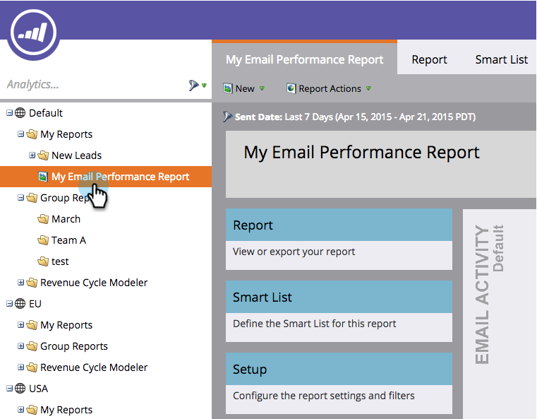

# 保存报告 {#save-a-report}

有时，您可能需要保存默认报表才能稍后再次查看。 以下是具体操作方法：

1. 转到 **分析** 区域。

   

1. 选择 [报告类型](/help/marketo/product-docs/reporting/basic-reporting/report-types/report-type-overview.md).

   

1. 单击 **报表操作** 并选择 **另存为**.

   

1. **保存到** 位置并选择 **文件夹**.

   

1. **名称** 报告并单击 **保存**.

   

   酷！ 此时树中将显示已保存的报告。

   

>[!MORELIKETHIS]
>
>了解如何 [将报表克隆到组报表](/help/marketo/product-docs/reporting/basic-reporting/report-activity/clone-a-report-to-group-reports.md).
