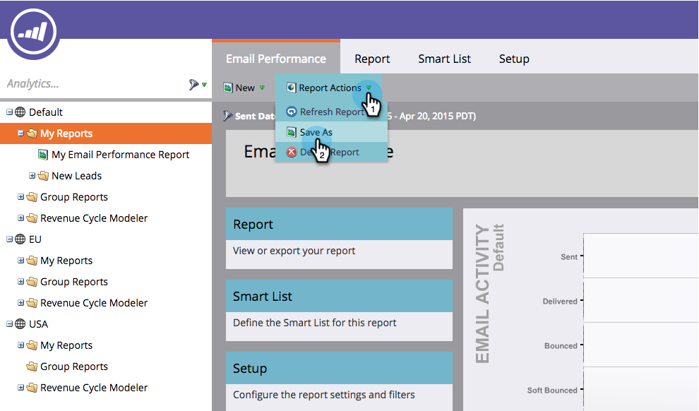

# 保存报告 {#save-a-report}

有时，您可能需要保存默认报表才能稍后再次查看。 以下是具体操作方法：

1. 转到&#x200B;**[!UICONTROL Analytics]**&#x200B;区域。

   

1. 选择[报告类型](/help/marketo/product-docs/reporting/basic-reporting/report-types/report-type-overview.md)。

   

1. 单击&#x200B;**[!UICONTROL Report Actions]**&#x200B;并选择&#x200B;**[!UICONTROL Save As]**。

   

1. **[!UICONTROL Save To]**&#x200B;位置并选择&#x200B;**[!UICONTROL Folder]**。

   

1. **[!UICONTROL Name]**&#x200B;报告，然后单击&#x200B;**[!UICONTROL Save]**。

   

   酷！ 此时树中将显示已保存的报告。

   

>[!MORELIKETHIS]
>
>了解如何[将报告克隆到组报告](/help/marketo/product-docs/reporting/basic-reporting/report-activity/clone-a-report-to-group-reports.md)。
