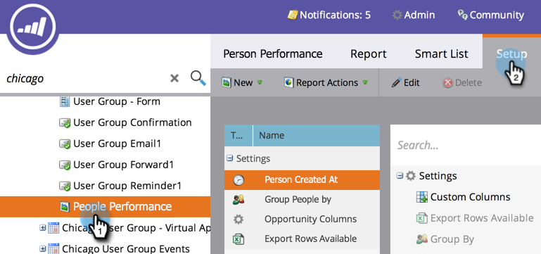
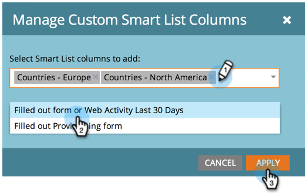

# 向人员报告添加自定义列 {#add-custom-columns-to-a-person-report}

您可以将[智能列表](/help/marketo/product-docs/core-marketo-concepts/smart-lists-and-static-lists/understanding-smart-lists.md)用作自定义列，以进一步筛选人员报表中的量度。

1. 转到&#x200B;**[!UICONTROL Marketing Activities]**（或&#x200B;**[!UICONTROL Analytics]**）区域。

   

1. 选择您的报告并单击&#x200B;**[!UICONTROL Setup]**&#x200B;选项卡。

   

1. 拖动到&#x200B;**[!UICONTROL Custom Columns]**&#x200B;上方。

   

1. 选择要用作报表列的智能列表。

   

1. 你做到了！ 单击&#x200B;**[!UICONTROL Report]**&#x200B;选项卡以查看包含新列的报表。

   

   >[!MORELIKETHIS]
   >
   >您还可以[将机会列添加到潜在客户报告](/help/marketo/product-docs/reporting/basic-reporting/editing-reports/add-opportunity-columns-to-a-lead-report.md)。
