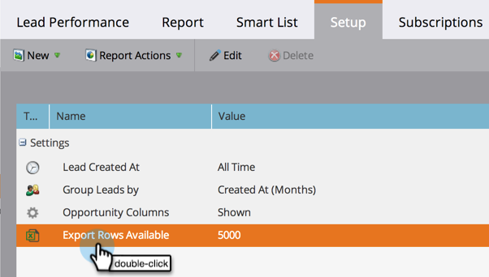

# 配置报告大小{#configure-report-size}

默认情况下，Marketo报表最多限制为5,000行，但您可以更改该限制。

1. 转至&#x200B;**营销活动**&#x200B;区域。

   

1. 从导航树中选择您的报表，然后单击&#x200B;**设置**&#x200B;选项卡。

   

1. 多次 — 单击&#x200B;**导出可用行**。

   

1. 选择新限制。

   

   >[!TIP]
   >
   >更改限制会更改报表大小本身，而不仅仅是导出的Excel文件，因此，如果报表生成时间过长，请减少限制！

1. 单击&#x200B;**保存**&#x200B;以确认新限制。

   

   你完了！ 报告将遵守新的限制。

   >[!MORELIKETHIS]
   >
   >您可以[使用新限制导出报表](/help/marketo/product-docs/reporting/basic-reporting/report-activity/export-a-report-to-excel.md)。
