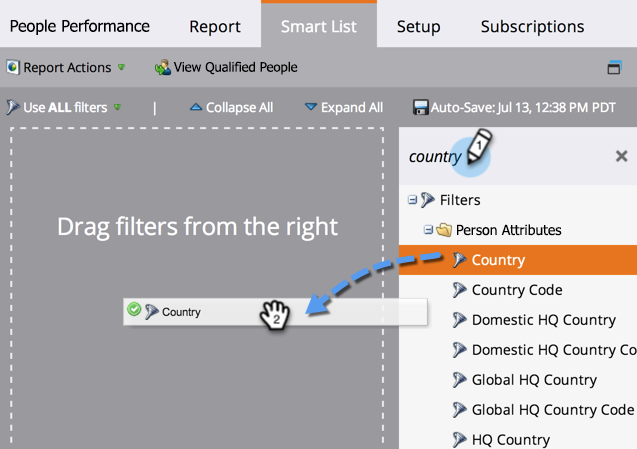

# 使用智能列表{#filter-people-in-a-report-with-a-smart-list}过滤报表中的人员

使用智能列表按特定人员属性筛选报表。

您可以对以下报表类型使用智能列表:

* [人员绩效](../../../../product-docs/reporting/basic-reporting/report-types/people-performance-report.md)
* [按状态划分的人员](../../../../product-docs/reporting/basic-reporting/report-types/people-by-status-report.md)
* [按收入阶段划分的人员](https://docs.marketo.com/display/DOCS/People+by+Revenue+Stage+Report)
* [电子邮件性能](../../../../product-docs/email-marketing/email-programs/email-program-data/email-performance-report.md)
* [电子邮件链接性能](../../../../product-docs/email-marketing/email-programs/email-program-data/email-link-performance-report.md)
* [参与流性能](../../../../product-docs/email-marketing/drip-nurturing/reports-and-notifications/engagement-stream-performance-report.md)
* [活动活动](../../../../product-docs/reporting/basic-reporting/report-types/campaign-activity-report.md)
* [活动电子邮件性能](../../../../product-docs/reporting/basic-reporting/report-types/campaign-email-performance-report.md)
* [公司 Web活动](../../../../product-docs/reporting/basic-reporting/report-types/company-web-activity-report.md)
* [网页活动](../../../../product-docs/reporting/basic-reporting/report-types/web-page-activity-report.md)

1. 转至&#x200B;**营销活动**&#x200B;区域。

   

1. 从导航树中选择您的报表，然后单击&#x200B;**智能列表**&#x200B;选项卡。

   

1. 找到合适的过滤器，然后将其拖动。

   

1. 配置过滤器。

   

1. 单击&#x200B;**报表**&#x200B;选项卡以查看已过滤的报表。

   

   太棒了！ 现在，您的报表只显示与智能列表匹配的人员的数据。

   >[!NOTE]
   >
   >**深潜**
   >
   >
   >有关报表的更多使用方式，请参阅[基本报告](https://docs.marketo.com/display/docs/basic+reporting)深入介绍。

