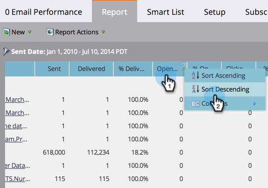

# 对列{#sort-report-on-columns}的报表排序

使用列对报表中的数据进行排序，使最重要的图形易于查找。

1. 转至&#x200B;**Analytics**(或&#x200B;**营销活动**)。

   

1. 从导航树中选择您的报表，然后单击&#x200B;**报表**&#x200B;选项卡。

   

1. 单击最重要的列并选择排序顺序。

   

1. 太棒了！ 现在，您可以专注于报表中最有趣的数据。

   

   >[!MORELIKETHIS]
   >
   >[选择报表列](/help/marketo/product-docs/reporting/basic-reporting/editing-reports/select-report-columns.md)
