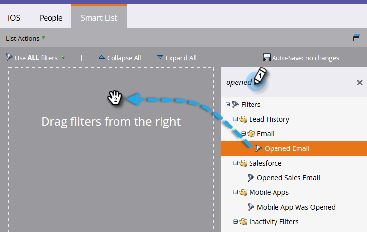

# 使用Mobile Platform列构建人员性能报表 {#build-a-people-performance-report-with-mobile-platform-columns}

请按照以下步骤操作，创建带有移动平台(iOS/Android)列的“人员性能报表”。

## 创建移动设备智能列表 {#create-mobile-smart-lists}

1. 转到 **营销活动**.

   

1. 选择项目。

   

1. 在 **新建**，选择 **新建本地资产**.

   

1. 单击 **智能列表**.

   

1. 键入名称并单击 **创建**.

   

1. 查找“已打开的电子邮件”过滤器并将其拖到画布中。

   

1. 将电子邮件设置为 **any**.

   

1. 单击 **添加约束** 选择 **平台**.

   

   >[!TIP]
   >
   >在此示例中，我们使用了“已打开的电子邮件”过滤器。 您还可以使用“已单击的电子邮件”过滤器，因为该过滤器具有平台约束。

1. 将平台设置为 **iOS**.

   

   >[!NOTE]
   >
   >必须至少有一个人在iOS设备上打开了您的电子邮件之一，Marketo才能自动提出查找建议。 如果未显示，您可以手动键入并保存。

   现在，为“Android”平台创建第二个智能列表。 完成后，转到下一部分。

## 创建人员绩效报表 {#create-a-people-performance-report}

1. 在营销活动下，选择容纳您的 **iOS** 和 **Android** 智能列表。

   

1. 在 **新建**，选择 **新建本地资产**.

   

1. 单击 **报表**.

   

1. 将类型设置为 **人员绩效**.

   

1. 单击&#x200B;**创建**。

   

   你做得很好！ 现在转到下一节。

## 将移动设备智能列表添加为列 {#add-mobile-smart-lists-as-columns}

1. 在刚刚创建的报表中，单击 **设置**，然后拖动 **自定义列** 放到画布上。

   

   >[!NOTE]
   >
   >默认情况下，“人员绩效”报表会查看过去7天的情况。 您可以通过双击来更改时间范围。

1. 查找并选择您之前创建的智能列表，然后单击 **应用**.

   

1. 单击 **报表** 运行报表并查看数据。

   

   很酷吧？ 干得好！
