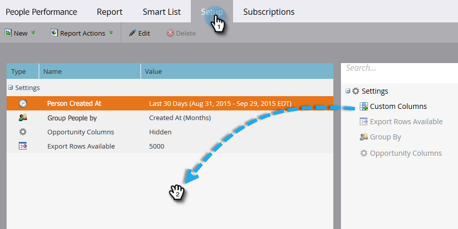

# 使用Mobile Platform列构建人员绩效报表 {#build-a-people-performance-report-with-mobile-platform-columns}

按照以下步骤创建使用Mobile Platform (iOS/Android)列的人员绩效报表。

## 创建移动设备智能列表 {#create-mobile-smart-lists}

1. 转到&#x200B;**营销活动**。

   

1. 选择程序。

   

1. 在&#x200B;**新建**&#x200B;下，选择&#x200B;**新建本地资产**。

   

1. 单击&#x200B;**智能列表**。

   

1. 键入名称，然后单击&#x200B;**创建**。

   

1. 查找打开的电子邮件筛选器并将其拖动到画布中。

   

1. 将电子邮件设置为&#x200B;**是任意**。

   

1. 单击&#x200B;**添加约束**&#x200B;并选择&#x200B;**平台**。

   

   >[!TIP]
   >
   >在此示例中，我们使用了“已打开电子邮件”过滤器。 您还可以使用“已点击电子邮件”过滤器，因为它具有“平台”限制。

1. 将Platform设置为&#x200B;**iOS**。

   

   >[!NOTE]
   >
   >必须至少有一个人在iOS设备上打开了您的某个电子邮件，Marketo的自动建议才能找到它。 如果未出现，您可以手动键入并保存。

   现在，为“Android”平台创建第二个智能列表。 完成后，转到下一部分。

## 创建人员绩效报表 {#create-a-people-performance-report}

1. 在“营销活动”下，选择包含您的&#x200B;**iOS**&#x200B;和&#x200B;**Android**&#x200B;智能列表的程序。

   

1. 在&#x200B;**新建**&#x200B;下，选择&#x200B;**新建本地资产**。

   

1. 单击&#x200B;**报告**。

   

1. 将类型设置为&#x200B;**人员性能**。

   

1. 单击&#x200B;**创建**。

   

   你做得很好！ 现在转到下一部分。

## 将移动设备智能列表添加为列 {#add-mobile-smart-lists-as-columns}

1. 在刚刚创建的报告中，单击&#x200B;**设置**，然后将&#x200B;**自定义列**&#x200B;拖到画布中。

   

   >[!NOTE]
   >
   >默认情况下，人员绩效报表会查看过去7天。 您可以通过双击该时间范围来更改时间范围。

1. 查找并选择您之前创建的智能列表，然后单击&#x200B;**应用**。

   

1. 单击&#x200B;**报告**&#x200B;运行报告并查看您的数据。

   

   很酷吧？ 做得好！
