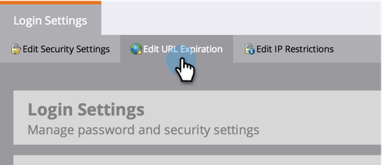

# 更改报表电子邮件{#change-the-expiration-time-for-urls-in-report-emails}中URL的过期时间

>[!NOTE]
>
>**需要管理权限**

报表订阅电子邮件中的链接将在三天后过期。 要更改这些链接的过期时间，请执行以下步骤。

1. 在&#x200B;**Admin**&#x200B;下，单击&#x200B;**登录设置**。

   

1. 单击&#x200B;**编辑URL过期**&#x200B;按钮。

   

1. 从下拉菜单中选择链接过期的天数。 单击&#x200B;**保存**。

   

   不错，您已编辑了电子邮件链接过期设置。

   >[!NOTE]
   >
   >请记住，这些仅适用于报表和警报中的链接，而不适用于营销电子邮件。
