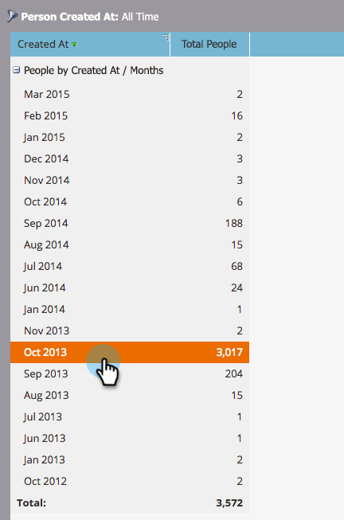
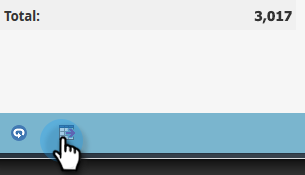

# 深入分析人员性能报告 {#drill-down-in-a-people-performance-report}

在人员业绩报表中进行追溯以查看附加人员信息。

1. 单击&#x200B;**[!UICONTROL Report]**&#x200B;选项卡以查看任何现有报表。

   

1. 在报表中选择要了解更多信息的行。

   

1. 单击&#x200B;**[!UICONTROL Drill-Down]**。

   

1. 在&#x200B;**[!UICONTROL Drill-Down]**&#x200B;弹出窗口中，选择要深入查看的属性。 接着，单击 **[!UICONTROL Drill-Down]**。

   

1. 做得好！ 向下钻取报告将在新选项卡中打开。 现在，您可以浏览新报表。

   >[!TIP]
   >
   >如果您没有看到新的报表选项卡处于打开状态，则可能是浏览器阻止了弹出窗口。 更改浏览器设置以允许此操作。

   

1. 要保存结果（可选），请单击左下角的&#x200B;**[!UICONTROL Export]**&#x200B;图标。

   
