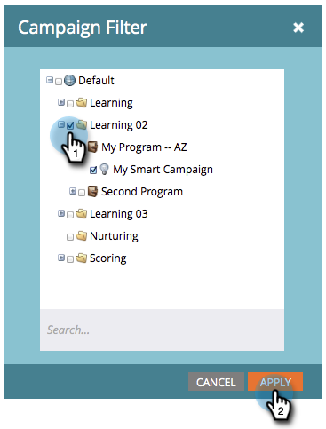

# 筛选营销活动报告 {#filter-a-campaign-activity-report}

将[促销活动报告](/help/marketo/product-docs/reporting/basic-reporting/report-types/campaign-activity-report.md)的重点放在特定的[智能促销活动](/help/marketo/product-docs/core-marketo-concepts/smart-campaigns/creating-a-smart-campaign/understanding-batch-and-trigger-smart-campaigns.md)上。

>[!NOTE]
>
>卫星模式（资源详细信息页面右侧的“在新窗口中打开”图标）不支持在报表中筛选资源。

1. 转到&#x200B;**营销活动**（或&#x200B;**Analytics**）并选择您的营销活动报告。

   

1. 单击&#x200B;**[!UICONTROL Setup]**&#x200B;选项卡并双击&#x200B;**[!UICONTROL Campaigns]**。

   

1. 选择要包含在报表中的文件夹和特定的智能营销活动。 单击 **[!UICONTROL Apply]**。

   

   >[!TIP]
   >
   >如果选择文件夹，则报表将包含该文件夹在报表运行时包含的所有内容。

1. 完成了！ 单击“**[!UICONTROL Report]**”选项卡，查看报表中&#x200B;_仅_&#x200B;选定的智能营销活动。

   

>[!MORELIKETHIS]
>
>[营销活动电子邮件性能报告](/help/marketo/product-docs/reporting/basic-reporting/report-types/campaign-email-performance-report.md)
