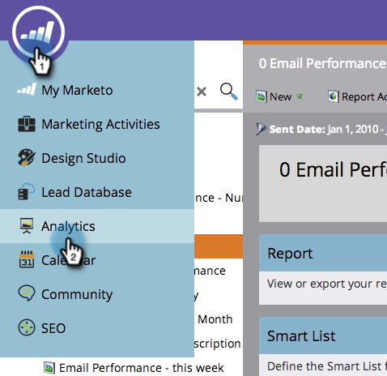

# 筛选活动电子邮件报表中的资产{#filter-assets-in-a-campaign-email-reports}

将您的[活动电子邮件性能](/help/marketo/product-docs/reporting/basic-reporting/report-types/campaign-email-performance-report.md)报告集中在项目（“本地资产”）中特定的[智能活动](/help/marketo/product-docs/core-marketo-concepts/smart-campaigns/creating-a-smart-campaign/understanding-batch-and-trigger-smart-campaigns.md)或已存档的客户上。

1. 转至&#x200B;**Analytics**(或&#x200B;**营销活动**)区域。

   

1. 选择您的电子邮件性能报告。

   

1. 单击&#x200B;**设置**&#x200B;选项卡并拖动到过滤器上。

   

   * **活动**:您的Marketo帐户中的活动智能活动。
   * **存档活动**:非活动、已停用的智能活动。

1. 选择要包含在报表中的文件夹和特定智能活动。

   

   >[!TIP]
   >
   >如果您选择了文件夹，则您的报表将包含运行报表时该文件夹包含的所有内容。

1. 你完了！ 单击&#x200B;**报表**&#x200B;选项卡以查看已过滤的报表。

   

   >[!MORELIKETHIS]
   >
   >[活动电子邮件性能报告](/help/marketo/product-docs/reporting/basic-reporting/report-types/campaign-email-performance-report.md)
   >[筛选电子邮件报表中的资产](/help/marketo/product-docs/reporting/basic-reporting/report-activity/filter-assets-in-an-email-report.md)
