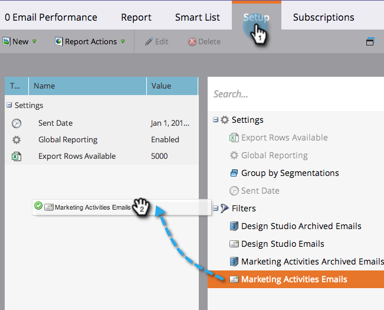
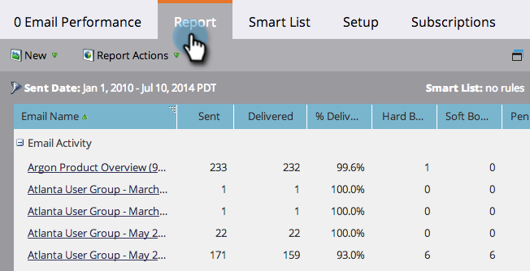

# 在电子邮件报表中筛选资源 {#filter-assets-in-an-email-report}

关注您的 [电子邮件性能](/help/marketo/product-docs/email-marketing/email-programs/email-program-data/email-performance-report.md) 或 [电子邮件链接性能](/help/marketo/product-docs/email-marketing/email-programs/email-program-data/email-link-performance-report.md) 报告程序（“本地资产”）中的电子邮件、Design Studio中的电子邮件（“全局资产”）或已存档的电子邮件。

1. 转到 **分析** (或 **营销活动**)区域。

   

1. 选择您的电子邮件报表。

   

1. 单击 **设置** 制表符并拖动到筛选器上。

   

   * **Design Studio电子邮件**：全局资产，在设计工作室中管理。
   * **营销活动电子邮件**：营销活动选项卡上项目中的本地资产。
   * **归档的电子邮件**：不活动、已弃用的电子邮件。

1. 选择要包含在报表中的文件夹和特定电子邮件。

   

   >[!TIP]
   >
   >如果选择文件夹，则报表将包含该文件夹在报表运行时包含的所有内容。

1. 你完了！ 单击 **报表** 选项卡，以查看已过滤的报告。

   

>[!MORELIKETHIS]
>
>[在营销活动电子邮件报表中筛选资源](/help/marketo/product-docs/reporting/basic-reporting/report-activity/filter-assets-in-a-campaign-email-reports.md)
