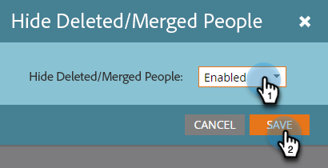

# 筛选电子邮件性能报告中的已删除/已合并记录 {#filter-deleted-merged-records-in-an-email-performance-report}

将电子邮件性能报表的重点放在程序（“本地资产”）中的电子邮件、Design Studio中的电子邮件（“全局资产”）或已存档的电子邮件上。

>[!NOTE]
>
>卫星模式（资源详细信息页面右侧的“在新窗口中打开”图标）不支持在报表中筛选资源。

1. 转到&#x200B;**Analytics**（或营销活动）区域。

   

1. 选择您的电子邮件性能报表。

   

1. 单击&#x200B;**设置**&#x200B;选项卡，然后选择&#x200B;**隐藏已删除/合并的人员**。

   

1. 单击下拉列表，选择&#x200B;**已启用**，然后单击&#x200B;**保存**。

   

完成了！ 单击报告选项卡，可查看已过滤的报告。
