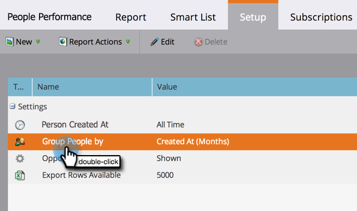
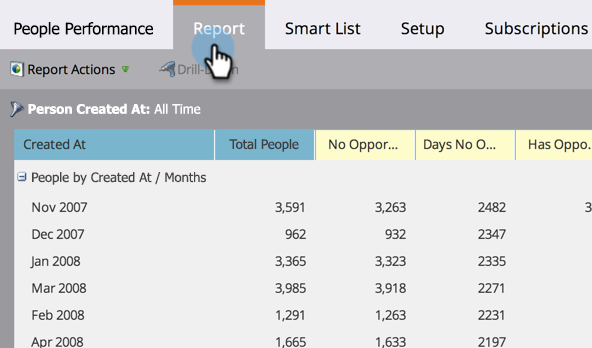

# 按属性分组人员报表 {#group-person-reports-by-attribute}

您可以按任何人员或公司属性对人员报表进行分组。

1. 转到 **营销活动** (或 **Analytics**)区域。

   

1. 从导航树中选择您的人员报表，然后单击 **设置** 选项卡。

   

1. 双击 **人员分组依据**.

   

   >[!NOTE]
   >
   >您还可以 [按区段对人员报表进行分组](/help/marketo/product-docs/personalization/segmentation-and-snippets/segmentation/group-person-reports-by-segment.md).

   在“按人员分组”对话框中，选择要用于分组的人员或公司属性。

   

   >[!TIP]
   >
   >如果您选择的属性具有数值，例如 _创建时间_ 或 _年收入_，从 **件数** 右下拉。

   就这样！ 单击“报表”选项卡可查看相应的报表分组。

   

   >[!MORELIKETHIS]
   >
   >[向人员报表添加自定义列](/help/marketo/product-docs/reporting/basic-reporting/editing-reports/add-custom-columns-to-a-person-report.md)
