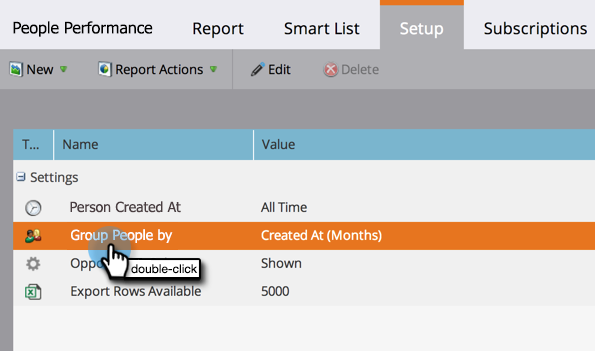

# 按属性对人员报告进行分组 {#group-person-reports-by-attribute}

您可以按任何人员或公司属性对人员报表进行分组。

1. 转到&#x200B;**[!UICONTROL Marketing Activities]**（或&#x200B;**[!UICONTROL Analytics]**）区域。

   

1. 从导航树中选择您的人员报表，然后单击&#x200B;**[!UICONTROL Setup]**&#x200B;选项卡。

   

1. 双击&#x200B;**[!UICONTROL Group People by]**。

   

   >[!NOTE]
   >
   >您也可以[按区段](/help/marketo/product-docs/personalization/segmentation-and-snippets/segmentation/group-person-reports-by-segment.md)对人员报表进行分组。

   在[!UICONTROL Group People by]对话框中，选择要用于分组的人员或公司属性。

   

   >[!TIP]
   >
   >如果选择具有数字值的属性，如&#x200B;_[!UICONTROL Created At]_或_[!UICONTROL Annual Revenue]_，请从右侧的&#x200B;**[!UICONTROL Units]**&#x200B;下拉列表中选择量度。

   单击&#x200B;**[!UICONTROL Report]**&#x200B;选项卡以查看您的报告已进行相应分组。

   

   >[!MORELIKETHIS]
   >
   >[将自定义列添加到人员报表](/help/marketo/product-docs/reporting/basic-reporting/editing-reports/add-custom-columns-to-a-person-report.md)
