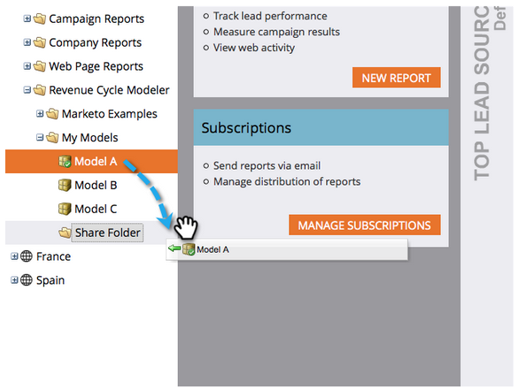

# 跨工作区共享模型{#share-a-model-across-workspaces}

Marketo使您能够跨工作区共享模型。 下面介绍如何操作。

1. 转至&#x200B;**Analytics**&#x200B;部分。

   

1. 右键单击&#x200B;**My Models**&#x200B;文件夹，然后单击&#x200B;**新建文件夹**。

   

1. 命名文件夹。

   

1. 将要共享的模型拖到&#x200B;**共享文件夹**&#x200B;中。

   

1. 右键单击您的文件夹，然后单击&#x200B;**共享文件夹**。

   

   >[!NOTE]
   >
   >与其他工作区共享模型允许这些用户基于模型运行报告。

1. 选择要与其共享文件夹的工作区，然后单击&#x200B;**保存**。

   

就这么简单！ 现在，来自其他工作区的人员可以在共享模型中移动。
