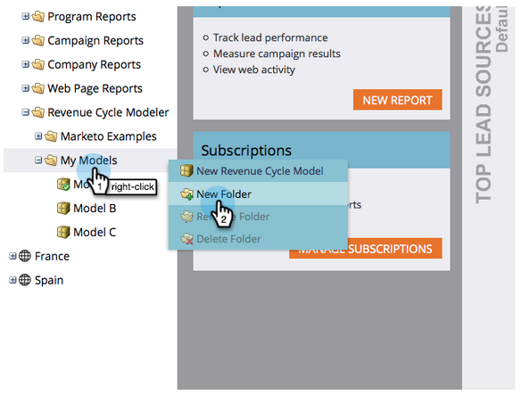

# 跨工作区共享模型 {#share-a-model-across-workspaces}

Marketo使您能够跨工作区共享模型。 操作方法如下：

1. 转到&#x200B;**[!UICONTROL Analytics]**&#x200B;部分。

   

1. 右键单击&#x200B;**[!UICONTROL My Models]**&#x200B;文件夹，然后单击&#x200B;**[!UICONTROL New Folder]**。

   

1. 命名文件夹。

   

1. 将要共享的模型拖到&#x200B;**[!UICONTROL Share Folder]**&#x200B;中。

   

1. 右键单击您的文件夹，然后单击&#x200B;**[!UICONTROL Share Folder]**。

   

   >[!NOTE]
   >
   >与其他工作区共享模型可让这些用户根据该模型运行报表。

1. 选择要与共享文件夹的工作区，然后单击&#x200B;**[!UICONTROL Save]**。

   

这太简单了！ 现在，来自其他工作区的人员可以在共享模型中移动。
