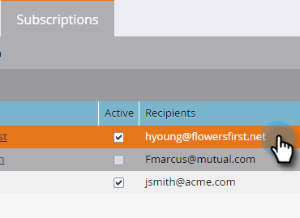

# 编辑智能列表订阅 {#edit-a-smart-list-subscription}

您可以直接在订阅选项卡中编辑这些列，该选项卡显示在营销活动或数据库中：

* 收件人
* 频率
* 列
* 结束投放
* 格式

1. 选择 **数据库** （在本例中，我们使用它，但营销活动的工作方式完全相同）。

   

1. 选择要编辑的订阅。

   

1. 单击收件人列并打开该列，以便您可以输入更多电子邮件地址（用逗号分隔）。

   

1. 单击 **频率** 列来选择或更改您的设置。

   

1. 打开 **列** 列并使用选择器来添加或移除报表中的列。 “报表列”包含所有可用的列，“Marketo列”仅显示您选择要在报表中显示的列。 单击 **保存**.

   

   >[!NOTE]
   >
   >Marketo列下的列是报表列，而不是订阅报表选项卡中使用的列。

1. 单击 **结束日期** 列来编辑结束日期。 选择 **从不** 或 **日期**. 对于日期，请输入日期或从日历中选择日期。 单击 **批准**.

   

1. 最后一步就是格式化。 单击 **格式** 列并选择所需的项。 CSV是默认设置。

   
