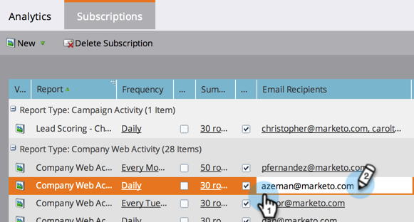
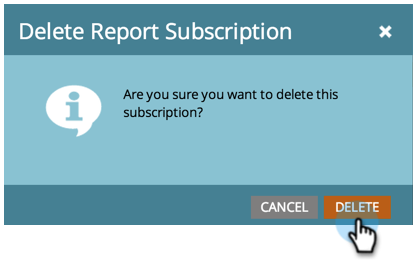

# 管理报告订阅 {#manage-report-subscriptions}

配置和删除报表订阅。

1. 进入 **[!UICONTROL Analytics]** 区域。

   

1. 单击 **[!UICONTROL Subscriptions]** 选项卡。

   

   此页面显示您帐户中所有报告的订阅，按[报告类型](/help/marketo/product-docs/reporting/basic-reporting/report-types/report-type-overview.md)分组。 这包括[基本报表](/help/marketo/product-docs/reporting/basic-reporting/report-subscriptions/subscribe-to-a-basic-report.md)和Revenue Cycle Explorer报表的订阅。

   >[!TIP]
   >
   >您还可以管理&#x200B;**[!UICONTROL Marketing Activities]**&#x200B;中单个报表的订阅。 选择报告并单击&#x200B;**[!UICONTROL Subscriptions]**&#x200B;选项卡。

   要更改通过电子邮件发送报告的频率，请单击频率字段，然后从下拉菜单中选择新选项。

   

1. 要更改订阅中的电子邮件地址，请单击&#x200B;**[!UICONTROL Email Recipients]**&#x200B;字段并编辑电子邮件地址。

   

   >[!TIP]
   >
   >* 在电子邮件地址之间使用逗号。
   >* 若要保存您的编辑，请在订阅列表&#x200B;_之外的_&#x200B;区域单击。

   您还可以：

   * 单击&#x200B;**[!UICONTROL View]**&#x200B;按钮打开报告。
   * 取消选中&#x200B;**[!UICONTROL Active]**&#x200B;复选框以停用订阅。
   * 单击并编辑&#x200B;**[!UICONTROL Summary]**&#x200B;字段以更改电子邮件中显示的预览行数。
   * 取消选中&#x200B;**[!UICONTROL Excel]**&#x200B;复选框可发送不带电子表格附件的报表摘要。
   * 单击&#x200B;**[!UICONTROL Send]**&#x200B;按钮立即发送报告电子邮件。

1. 要完全删除订阅，请选择该行并单击&#x200B;**[!UICONTROL Delete Subscription]**。

   

1. 确认您打算删除订阅。

   

   >[!MORELIKETHIS]
   >
   >* [订阅基本报表](/help/marketo/product-docs/reporting/basic-reporting/report-subscriptions/subscribe-to-a-basic-report.md)
   >* [订阅Revenue Explorer报表](/help/marketo/product-docs/reporting/revenue-cycle-analytics/revenue-explorer/subscribe-to-a-revenue-explorer-report.md)
