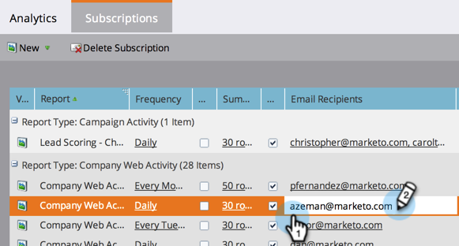

# 管理报告订阅 {#manage-report-subscriptions}

配置和删除报告订阅。

1. 转至“分 **析** ”区域。

   

1. 单击“ **订阅** ”选项卡。

   

   此页显示帐户中所有报表的订阅，按报表类 [型分组](../../../../product-docs/reporting/basic-reporting/report-types/report-type-overview.md)。 这包括 [基本报表和收入](subscribe-to-a-basic-report.md) 周期浏 [览器报表的订阅](http://docs.marketo.com/display/docs/revenue+cycle+analytics) 。

   >[!TIP]
   >
   >您还可以在营销订阅中管理单个报 **表的活动**。 选择报告，然后单击“ **订阅** ”选项卡。

   要更改通过电子邮件发送报告的频率，请单击“频率”字段，并从下拉菜单中选择新选项。

   

1. 要更改订阅中的电子邮件地址，请单击“电 **子邮件收件人** ”字段，然后编辑电子邮件地址。

   

   >[!TIP]
   >
   >
   >    
   >    
   >    * 电子邮件地址之间使用逗号。
   >    * 要保存编辑，请单击订阅 *列表* 外的某个区域。

   您还可以：

   * 单击 **视图** 按钮以打开报表。
   * 取消选 **中** “活动”复选框以取消激活订阅。
   * 单击并编辑“ **摘要** ”字段，以更改电子邮件中显示的预览行数。
   * 取消选中 **Excel复选** 框，可发送不带电子表格附件的报表摘要。
   * 单击“ **发送** ”按钮以立即发送报告电子邮件。

1. 要完全删除订阅，请选择该行并单击“删 **除订阅”**。

   

1. 确认您打算删除订阅。

   

   >[!NOTE]
   >
   >**相关文章**
   >
   >    
   >    
   >    * [订阅基本报告](subscribe-to-a-basic-report.md)
   >    * [订阅收入浏览器报表](../../../../product-docs/reporting/revenue-cycle-analytics/revenue-explorer/subscribe-to-a-revenue-explorer-report.md)

   在基本报告和收 [入周期浏览器](http://docs.marketo.com/display/docs/basic+reporting)[中了解更多信](http://docs.marketo.com/display/docs/revenue+cycle+analytics) 息，深入了解详情。

