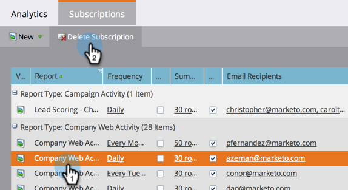

# 管理报告订阅{#manage-report-subscriptions}

配置和删除报表订阅。

1. 转至&#x200B;**Analytics**&#x200B;区域。

   

1. 单击&#x200B;**订阅**&#x200B;选项卡。

   

   此页显示帐户中所有报表的订阅，按[报表类型](../../../../product-docs/reporting/basic-reporting/report-types/report-type-overview.md)分组。 这包括对基本报表](subscribe-to-a-basic-report.md)和[收入周期浏览器](https://docs.marketo.com/display/docs/revenue+cycle+analytics)报表的[订阅。

   >[!TIP]
   >
   >您还可以在&#x200B;**营销活动**&#x200B;中管理对单个报表的订阅。 选择报告并单击&#x200B;**订阅**&#x200B;选项卡。

   要更改通过电子邮件发送报表的频率，请单击“频率”字段，然后从下拉菜单中选择新选项。

   

1. 要更改订阅中的电子邮件地址，请单击&#x200B;**电子邮件收件人**&#x200B;字段并编辑电子邮件地址。

   

   >[!TIP]
   >
   >
   >    
   >    
   >    * 电子邮件地址之间使用逗号。
   >    * 要保存编辑，请在&#x200B;*外部*&#x200B;的订阅列表中单击。

   您还可以：

   * 单击&#x200B;**视图**&#x200B;按钮以打开报表。
   * 取消选中&#x200B;**活动**&#x200B;复选框以停用订阅。
   * 单击并编辑&#x200B;**摘要**&#x200B;字段，以更改电子邮件中显示的预览行数。
   * 取消选中&#x200B;**Excel**&#x200B;复选框，可在不附带电子表格附件的情况下发送报表摘要。
   * 单击&#x200B;**发送**&#x200B;按钮以立即发送报告电子邮件。

1. 要完全删除订阅，请选择该行并单击&#x200B;**删除订阅**。

   

1. 确认您打算删除订阅。

   

   >[!MORELIKETHIS]
   >
   >
   >    
   >    
   >    * [订阅基本报告](subscribe-to-a-basic-report.md)
   >    * [订阅收入浏览器报表](../../../../product-docs/reporting/revenue-cycle-analytics/revenue-explorer/subscribe-to-a-revenue-explorer-report.md)

   在[基本报告](https://docs.marketo.com/display/docs/basic+reporting)和[收入周期浏览器](https://docs.marketo.com/display/docs/revenue+cycle+analytics)深潜中了解更多信息。

