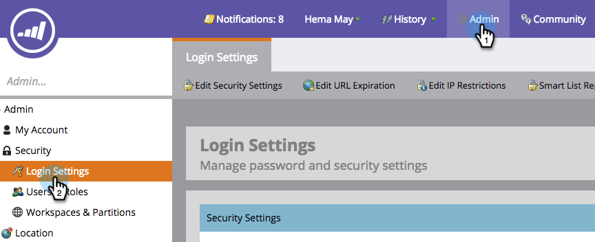

# 保护订阅管理员设置 {#secure-the-subscription-admin-setting}

>[!NOTE]
>
>**需要管理员权限**

管理员可以选择需要登录才能查看报表。

1. 单击 **管理员**，然后 **登录设置**.

   

1. 单击 **编辑** ，以了解智能列表报表设置。

   

1. 选择 **是** 以要求登录才能下载报表。

   

   >[!CAUTION]
   >
   >当需要登录才能下载报表时，如果您无权访问Marketo，则将不会收到智能列表报表电子邮件。 这适用于现有和未来的订阅。
