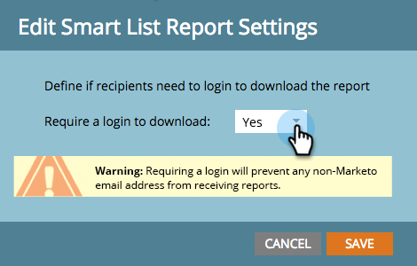

# 保护订阅管理设置 {#secure-the-subscription-admin-setting}

>[!NOTE]
>
>**需要管理员权限**

管理员可以选择需要登录才能视图报告。

1. 单击 **管理**，然后单 **击登录设置**。

   

1. 单击 **编辑** “智能列表报表设置”。

   

1. 选择 **“是** ”以要求登录才能下载报告。

   

   >[!CAUTION]
   >
   >当需要登录才能下载报告时，如果您无权访问Marketo，您将不会收到智能列表报告电子邮件。 这适用于现有和未来订阅。

