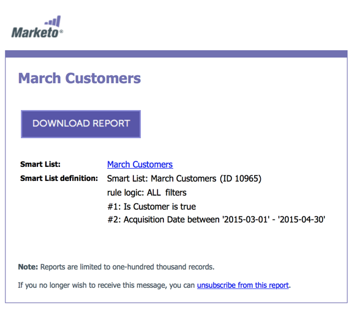

# 订阅智能列表 {#subscribe-to-a-smart-list}

订阅智能列表是一种很好的跟踪人员的方法，报表会直接发送到您的收件箱。

您可以在两个不同的位置创建智能列表订阅：

* [!UICONTROL Marketing Activities]
* [!UICONTROL Database]

订阅使用运行订阅时的完整人员列表。

在[!UICONTROL Marketing Activities]或[!UICONTROL Database]中，您的智能列表所在的位置有订阅。

您可以从同一智能列表创建多个订阅。

订阅特定于工作区。 例如，此订阅列表与本文其余部分中显示的工作区不同：

>[!NOTE]
>
>每个Marketo实例限制为100个订阅，每个订阅最多包含100,000名人员（跨工作区）。 如果智能列表包含超过100,000个名称，Marketo将为前100,000个运行订阅。

## 创建智能列表订阅 {#create-a-smart-list-subscription}

1. 转到&#x200B;**[!UICONTROL Database]**&#x200B;或&#x200B;**[!UICONTROL Marketing Activities]**。

   

1. 选择要为其创建订阅的智能列表。 单击&#x200B;**[!UICONTROL List Actions]**&#x200B;并选择&#x200B;**[!UICONTROL New Smart List Subscription]**。

   

1. 为您的订阅提供&#x200B;**[!UICONTROL Name]**，然后选择或输入&#x200B;**[!UICONTROL Recipients]**&#x200B;的电子邮件地址。

   

1. 单击&#x200B;**[!UICONTROL Frequency]**&#x200B;列表并选择频率。

   

1. 设置&#x200B;**[!UICONTROL End Delivery]**&#x200B;日期。 您可以选择&#x200B;**[!UICONTROL Never]**&#x200B;或日历日期。

   

1. 单击&#x200B;**[!UICONTROL Format]**&#x200B;并从列表中选择。

   

1. 单击 **[!UICONTROL Create]**。

   

1. 您的新智能列表订阅将显示在“订阅”选项卡的列表顶部。 如果要立即发送，而不是等到计划的电子邮件发送，请单击&#x200B;**[!UICONTROL Send]**。

   

1. 我们建议您清除&#x200B;**[!UICONTROL Active]**&#x200B;复选框，以便在无人订阅智能列表订阅时将其停用。

   

   这很容易，不是吗？

## 电子邮件 {#email-message}

收件人将收到一封包含下载报表选项的电子邮件，以及一个直接指向Marketo实例中列表的链接。 下载链接将在四天后过期。

>[!NOTE]
>
>如果[安全订阅管理员](/help/marketo/product-docs/reporting/basic-reporting/report-subscriptions/secure-the-subscription-admin-setting.md)设置设置为&#x200B;**[!UICONTROL Yes]**，则只有有权访问Marketo实例的用户才能下载报表。

如果报表中包含0人，收件人仍会收到电子邮件。 但是，电子邮件仅声明没有人员可报告。

>[!NOTE]
>
>修改基于订阅的智能列表筛选器时，也会更新报表。

电子邮件还提供了有关用于创建列表的过滤器的其他信息。

## 删除订阅 {#delete-a-subscription}

要删除订阅，请在“订阅”选项卡中选择该订阅，然后单击&#x200B;**[!UICONTROL Delete Subscription]**。

>[!MORELIKETHIS]
>
>* [编辑智能列表订阅](/help/marketo/product-docs/reporting/basic-reporting/report-subscriptions/edit-a-smart-list-subscription.md)
>* [保护订阅管理设置](/help/marketo/product-docs/reporting/basic-reporting/report-subscriptions/secure-the-subscription-admin-setting.md)
