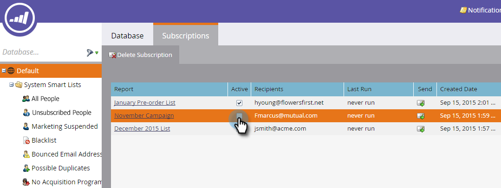

# 订阅智能列表 {#subscribe-to-a-smart-list}

订阅智能列表是跟踪人员的绝佳方式，报表会直接发送到您的收件箱。

您可以在两个不同的位置创建智能列表订阅：

* 营销活动
* 数据库

订阅使用运行订阅时的完整人员列表。

营销活动或数据库中的订阅位于您的智能列表所在的位置。

您可以从同一智能列表创建多个订阅。

订阅特定于工作区。 例如，此订阅列表位于与本文其余部分所示订阅列表不同的工作区中：

>[!NOTE]
>
>每个Marketo实例最多限制为100个订阅，每个订阅（跨工作区）最多为100,000人。 如果智能列表包含的名称超过100,000个，则Marketo将为前100,000运行订阅。

## 创建智能列表订阅 {#create-a-smart-list-subscription}

1. 转到 **数据库** 或 **营销活动**.

   

1. 选择要为其创建订阅的智能列表。 单击 **列出操作** 选择 **新的智能列表订阅**.

   

1. 为您的订阅提供 **名称**，然后选择或输入 **收件人**.

   

1. 单击 **频率** 列表并选择频度。

   

1. 设置 **最终交付** 日期。 您可以选择 **从不** 或日历日期。

   

1. 单击 **格式** 然后从列表中选择。

   

1. 单击&#x200B;**创建**。

   

1. 您的新智能列表订阅将显示在订阅选项卡的列表顶部。 单击 **发送** 如果您想立即发送，而不是等到计划的电子邮件发送。

   

1. 如果没有人订阅智能列表订阅，我们建议您清除活动复选框以停用该订阅。

   

   那很简单，不是吗？

## 电子邮件消息 {#email-message}

收件人将收到一封电子邮件，其中包含下载报表的选项，以及直接指向Marketo实例中列表的链接。 下载链接将在四天后过期。

>[!NOTE]
>
>如果 [安全订阅管理员](/help/marketo/product-docs/reporting/basic-reporting/report-subscriptions/secure-the-subscription-admin-setting.md) 设置设置为 **是**，则只有具有Marketo实例访问权限的人员才能下载报表。

如果报表中有0个人，则收件人仍会收到电子邮件。 但是，电子邮件仅表示没有可报告的人员。

>[!NOTE]
>
>修改基于订阅的智能列表过滤器时，也会更新报表。

此电子邮件还提供有关用于创建列表的过滤器的其他信息。

## 删除订阅 {#delete-a-subscription}

要删除订阅，请在订阅选项卡中选择该订阅，然后单击删除订阅。

>[!MORELIKETHIS]
>
>* [编辑智能列表订阅](/help/marketo/product-docs/reporting/basic-reporting/report-subscriptions/edit-a-smart-list-subscription.md)
>* [保护订阅管理员设置](/help/marketo/product-docs/reporting/basic-reporting/report-subscriptions/secure-the-subscription-admin-setting.md)

