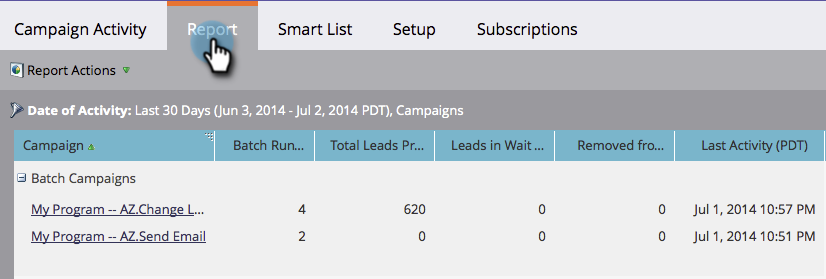

# 活动活动报告{#campaign-activity-report}

了解您的[智能活动](https://docs.marketo.com/display/docs/smart+campaigns)的执行情况。

1. [创建报](../../../../product-docs/reporting/basic-reporting/creating-reports/create-a-report-in-a-program.md) 表，然后选择 **活动** [活动报表类型](report-type-overview.md)。
1. [设置报表的时间范](../../../../product-docs/reporting/basic-reporting/editing-reports/change-a-report-time-frame.md) 围，然后单击报 **** 表标签。
1. 太棒了！ 浏览您的报告，确定按活动类型分组的最有效活动。

   &#39; 

   &#39;

   >[!TIP]
   >
   >要查找处理最多人的活动，例如，在&#x200B;*已处理人员总数*&#x200B;上对报表](../../../../product-docs/reporting/basic-reporting/editing-reports/sort-report-on-columns.md)排序，然后选择&#x200B;**降序排序**。[

   单击智能活动的名称以将其打开。  [您可以为活动](../../../../product-docs/reporting/basic-reporting/editing-reports/select-report-columns.md) 活动报表选择的列包括：

   | 列 | 说明 |
   |---|---|
   | 批处理运行计数 | 运行活动的次数。 |
   | 已处理人员总数 | 通过活动流的人数。 |
   | 等待步骤中的人 | 如果活动仍在运行，则在&#x200B;*等待*&#x200B;步骤中保留的人数。 |
   | 从流中删除 | 已从活动中删除的人数。 |
   | 上次活动 | 活动上次处理人员的时间。 |

   活动类型：

   | 类型 | 说明 |
   |---|---|
   | 批 | **营销活动**&#x200B;选项卡中的批活动。 |
   | 运行操作 | 从&#x200B;**Database**&#x200B;运行人员操作。 |
   | 已触发（活动） | **营销活动**&#x200B;选项卡中当前触发的活动。 |
   | 已触发（非活动） | 在&#x200B;**营销活动**&#x200B;选项卡中触发的非活动活动。 |

   >[!MORELIKETHIS]
   >
   >
   >    
   >    
   >    * [筛选活动活动报表](../../../../product-docs/reporting/basic-reporting/report-activity/filter-a-campaign-activity-report.md)

   请参阅[基本报告](https://docs.marketo.com/display/docs/basic+reporting)中的更多报告。

