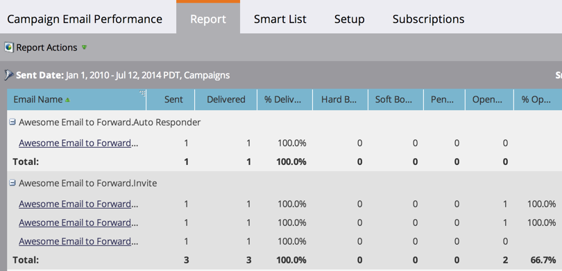

# 营销活动电子邮件性能报表 {#campaign-email-performance-report}

查看您的电子邮件性能统计信息，分组依据： [智能营销活动](/help/marketo/product-docs/core-marketo-concepts/smart-campaigns/creating-a-smart-campaign/understanding-batch-and-trigger-smart-campaigns.md)，运行营销活动电子邮件性能报表。

1. [创建报告](/help/marketo/product-docs/reporting/basic-reporting/creating-reports/create-a-report-in-a-program.md) 并选择 **营销活动电子邮件效果** [报告类型](/help/marketo/product-docs/reporting/basic-reporting/report-types/report-type-overview.md).

1. [设置报告的时间范围](/help/marketo/product-docs/reporting/basic-reporting/editing-reports/change-a-report-time-frame.md) 然后单击 **报表** 选项卡。

1. 现在，浏览该报表以查看营销活动中每个电子邮件的执行情况。

   

   >[!TIP]
   >
   >单击电子邮件的名称，以在电子邮件预览器中将其打开。

   [可选择的列](/help/marketo/product-docs/reporting/basic-reporting/editing-reports/select-report-columns.md)促销活动电子邮件效果报表包括：

   | 列 | 描述 |
   |---|---|
   | 硬退回 | 由于永久条件（如不存在电子邮件地址），电子邮件被拒绝。 |
   | 软退回 | 由于临时情况（如服务器关闭或收件箱已满），电子邮件被拒绝。 |
   | 待处理 | 电子邮件仍在投放过程中。 |
   | 已单击的链接 | 单击电子邮件中链接的电子邮件收件人数量。 |
   | 退订 | 单击“ ”的电子邮件收件人数 **取消订阅** 电子邮件中的链接并填写表单。 |

   >[!NOTE]
   >
   >一般来说，我们尝试用常识来记录这些统计数据。 例如，如果某人单击了电子邮件中的链接，则他们显然会先打开该链接。 有关我们遵循的特定规则，请参阅 [电子邮件性能报表](/help/marketo/product-docs/email-marketing/email-programs/email-program-data/email-performance-report.md).

   >[!MORELIKETHIS]
   >
   >* [在营销活动电子邮件报表中筛选资源](/help/marketo/product-docs/reporting/basic-reporting/report-activity/filter-assets-in-a-campaign-email-reports.md)
   >* [电子邮件性能报表](/help/marketo/product-docs/email-marketing/email-programs/email-program-data/email-performance-report.md)
