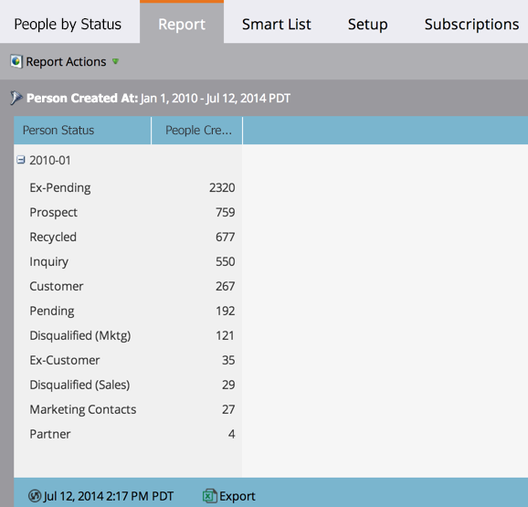

# 按状态人员报表 {#people-by-status-report}

通过检查每个流程中出现的人员数量，查看您在流程中转移人员的效果 _人员状态_ 每月值。

1. [创建报告](/help/marketo/product-docs/reporting/basic-reporting/creating-reports/create-a-report-in-a-program.md) 并选择 **按状态显示的人员** [报告类型](/help/marketo/product-docs/reporting/basic-reporting/report-types/report-type-overview.md).

1. [设置报告的时间范围](/help/marketo/product-docs/reporting/basic-reporting/editing-reports/change-a-report-time-frame.md) 并单击 **报告** 选项卡。

1. 太棒了！ 现在，您可以逐月查看每个人员状态中的人员数量。

   

   >[!TIP]
   >
   >单击加号(+)可按月展开，并查看每个人员状态的特定数字。

   >[!MORELIKETHIS]
   >
   >[使用智能列表筛选报表](/help/marketo/product-docs/reporting/basic-reporting/editing-reports/filter-people-in-a-report-with-a-smart-list.md) 和特定的人。
