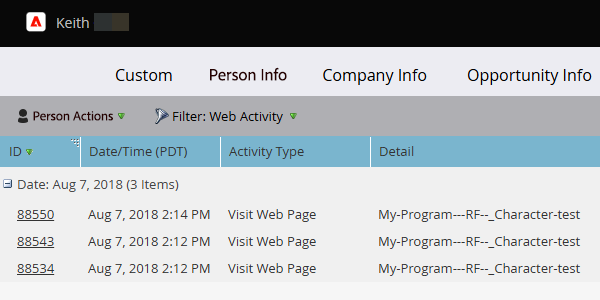

# Web 页面浏览量、Web 页面活动报告 {#web-pages-viewed-web-page-activity-report}

从[[!UICONTROL Web Page Activity]报表](/help/marketo/product-docs/reporting/basic-reporting/report-types/web-page-activity-report.md)中，您可以看到人员在该报表中查看的特定页面。

>[!PREREQUISITES]
>
>若要在Marketo中从您的网站捕获活动，您首先需要在您的网站[上 [!DNL Munchkin] 设置](/help/marketo/product-docs/administration/additional-integrations/add-munchkin-tracking-code-to-your-website.md)。

1. 在您的[网页活动报表](/help/marketo/product-docs/reporting/basic-reporting/report-types/web-page-activity-report.md)中，单击人员的姓名。

   

1. 此时将打开一个新选项卡，其中显示了人员访问过您的网站以及访问时间的页面列表。

   

   >[!MORELIKETHIS]
   >
   >创建[公司Web活动报告](/help/marketo/product-docs/reporting/basic-reporting/report-types/company-web-activity-report.md)，以查看哪些公司正在访问您的网站。
