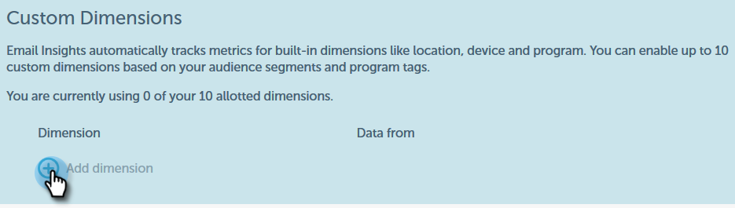

# 电子邮件分析的自定义Dimension{#custom-dimensions-for-email-insights}

包含所有标准Marketo维，但您可以选择最多添加10个自定义维。 自定义维度由细分和项目标记组成。 下面将介绍如何添加它们。

>[!NOTE]
>
>**需要管理权限**

>[!CAUTION]
>
>无法删除或替换自定义尺寸&#x200B;****，请谨慎选择10。

1. 在电子邮件分析中，单击页面右上角的齿轮图标。

   

1. 单击&#x200B;**系统**。

   

1. 单击&#x200B;**添加维度**&#x200B;旁边的&#x200B;**+**。

   

1. 开始选择！

   

   >[!NOTE]
   >
   >**按受众**:显示所有已批准的区段（从数据库中）
   >
   >**按内容**:显示所有项目标记
