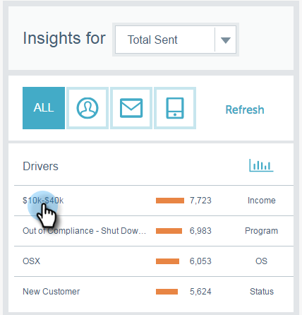

# 电子邮件分析Analytics概述 {#email-insights-analytics-overview}

在Analytics中，探索用于电子邮件投放和参与度的聚合数据。 使用左侧的图表浏览数据，使用右侧的见解获得更多引导式体验。

[正在筛选](/help/marketo/product-docs/reporting/email-insights/filtering-in-email-insights.md) 可用于帮助您深入了解特定量度。

兴趣点(KPI)图块可让您快速查看更热门的量度。

将鼠标悬停在KPI磁贴上可查看详细信息……

...或者无需通过扩展浏览器窗口（在大屏幕上）即可查看详细信息。

>[!TIP]
>
>那些颜色有意义！ 绿色表示更改良好，红色表示更改不良，灰色表示未更改任何内容。 这是基于您在过滤中选择的比较时段。

此图表显示了您的过滤标准。 要隐藏某个滤镜，只需单击其颜色栏……

...指标将从图表中消失。 再次单击颜色栏可使其重新显示。

如果您创建要再次使用的图表，请将其设为 [快速图表](/help/marketo/product-docs/reporting/email-insights/email-insights-quick-charts.md).

在页面的右侧，引导式量度可帮助您发现相关的驱动程序。 单击任意指标可在页面左侧的图表中查看该指标。

>[!NOTE]
>
>看到右上角的“刷新”了吗？ 如果您看到该窗口，则需要手动单击它以刷新分析模块。 我们仅在您对筛选条件进行了更改以使当前值失效时显示该变量。

您还可以指定您看到的内容（从左到右）：全部、受众、内容和平台。

>[!MORELIKETHIS]
>
>[电子邮件分析发送概述](/help/marketo/product-docs/reporting/email-insights/email-insights-sends-overview.md)
