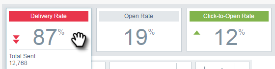
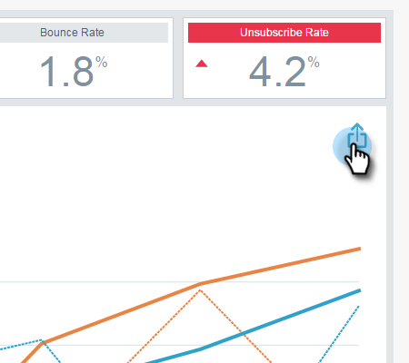

# 电子邮件分析概述 {#email-insights-analytics-overview}

在Analytics中，探索电子邮件投放和参与的汇总数据。 使用左侧的图表来探索数据，使用右侧的分析来提供更有指导性的体验。

[筛选](/help/marketo/product-docs/reporting/email-insights/filtering-in-email-insights.md) 可帮助您深入查看特定量度。

关键目标点(KPI)图块可让您快速查看更受欢迎的量度。

将鼠标悬停在KPI图块上可获取详细信息……

...或者，无需将鼠标悬停在浏览器窗口上即可查看详细信息（在较大的屏幕上）。

>[!TIP]
>
>那些颜色有意义！ 绿色表示良好的更改，红色表示不良的更改，灰色表示没有任何更改。 这基于您在过滤中选择的比较期。

图表会显示您的过滤标准。 要隐藏某个滤镜，只需单击其颜色栏……

...并且量度会从图表中消失。 再次单击颜色条以重新显示它。

如果创建要再次使用的图表，请将其设为 [快速图表](/help/marketo/product-docs/reporting/email-insights/email-insights-quick-charts.md).

在页面右侧，引导式量度可帮助您发现相关的驱动因素。 单击任意量度可在页面左侧的图表中查看该量度。

>[!NOTE]
>
>是否在右上方看到“刷新”？ 当您看到该模块时，将需要手动单击该模块以刷新分析模块。 仅当您对会使当前值失效的过滤器进行了更改时，才会显示该过滤器。

您还可以指定您看到的内容（从左到右）：全部、受众、内容和平台。

>[!MORELIKETHIS]
>
>[电子邮件分析发送概述](/help/marketo/product-docs/reporting/email-insights/email-insights-sends-overview.md)
