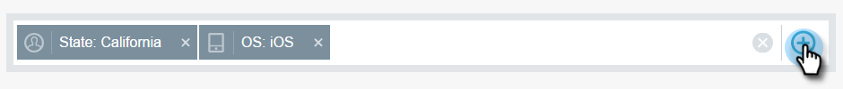
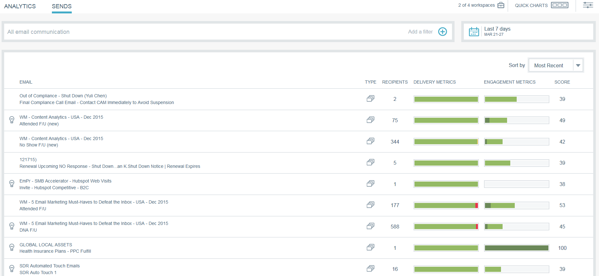

# 电子邮件洞察概述 {#email-insights-overview}

**[!UICONTROL Email Insights]**&#x200B;根据历史数据为电子邮件营销人员提供了强大的分析功能。 它包含两个独立但关联的节：[!UICONTROL Analytics]和[!UICONTROL Sends]。

要访问&#x200B;**[!UICONTROL Email Insights]**，只需在“我的Marketo”（或Analytics主屏幕）中单击其磁贴。

>[!NOTE]
>
>默认情况下，您将看到您有权访问的每个工作区的数据。 您可以取消选择不想查看的工作区。 以后将记住您的选择。

## [!UICONTROL Analytics] {#analytics}

使用[[!UICONTROL Analytics]](/help/marketo/product-docs/reporting/email-insights/email-insights-analytics-overview.md)浏览电子邮件投放和参与量度的聚合时间序列数据。

**过滤器**

已使用高级[筛选器](/help/marketo/product-docs/reporting/email-insights/filtering-in-email-insights.md)按受众、内容或平台划分结果。 相同的筛选器同时适用于[!UICONTROL Analytics]和[!UICONTROL Sends]。

**快速图表**

[快速图表](/help/marketo/product-docs/reporting/email-insights/email-insights-quick-charts.md)是您创建和保存的缩略图，可快速查看对您很重要的图表。

## [!UICONTROL Sends] {#sends}

在[[!UICONTROL Sends]](/help/marketo/product-docs/reporting/email-insights/email-insights-sends-overview.md)页面中，检查最近电子邮件通信的特征。

**个量度**

单击量度栏将颜色转换为数字。

>[!NOTE]
>
>数据可能需要长达8小时才能反映在&#x200B;**[!UICONTROL Email Insights]**&#x200B;中。

## 自定义维度 {#custom-dimensions}

虽然包括所有标准Marketo维度，但您可以选择最多添加10个自定义维度。 [自定义维度](/help/marketo/product-docs/reporting/email-insights/custom-dimensions-for-email-insights.md)包含分段和程序标记。

>[!MORELIKETHIS]
>
>* [电子邮件分析Analytics概述](/help/marketo/product-docs/reporting/email-insights/email-insights-analytics-overview.md)
>* [电子邮件分析发送概述](/help/marketo/product-docs/reporting/email-insights/email-insights-sends-overview.md)
