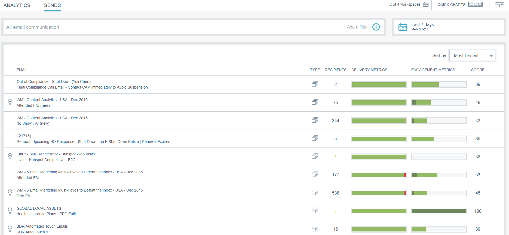

# 电子邮件分析概述{#email-insights-overview}

电子邮件洞察为电子邮件营销人员提供从历史数据中获得的强大洞察。 它包含两个单独但关联的部分：分析和发送。

要访问电子邮件分析，只需在My Marketo（或Analytics主屏幕）中单击其拼贴。   

>[!NOTE]
>
>默认情况下，您将看到您有权访问的每个工作区的数据。 您可以取消选择不想视图的工作区。 您的选择将被记住。

## 分析{#analytics}

使用[Analytics](email-insights-analytics-overview.md)浏览电子邮件聚合投放和参与度指标的时间序列数据。

**过滤器**

使用高级[过滤器](filtering-in-email-insights.md)按受众、内容或平台细分结果。 相同的过滤器适用于Analytics和Send。

**快速图表**

[快速](email-insights-quick-charts.md) 图表是您创建和保存的缩略图，提供了对您很重要的图表的快速视图。

## 发送{#sends}

在[发送](email-insights-sends-overview.md)页面中，检查最近电子邮件通信的特性。

**指标**

单击“度量”栏，将颜色转换为数字。

>[!NOTE]
>
>数据在电子邮件洞察中可能需要长达8小时的时间。

## 自定义Dimension{#custom-dimensions}

包含所有标准Marketo维，但您可以选择最多添加10个自定义维。 [自定](custom-dimensions-for-email-insights.md) 义维由段和项目标签组成。

>[!MORELIKETHIS]
>
>* [电子邮件洞察分析概述](email-insights-analytics-overview.md)
>* [电子邮件分析发送概述](email-insights-sends-overview.md)

>

