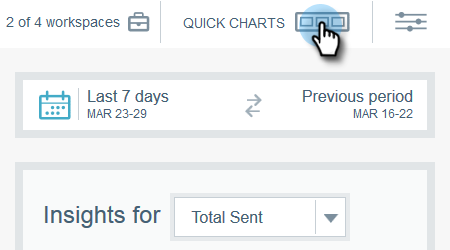

# 电子邮件分析快速图表 {#email-insights-quick-charts}

快速图表是您自定义和保存的缩略图，可快速查看您使用最多的图表。

## 新建快速图表 {#create-a-new-quick-chart}

在此示例中，我们将选择加利福尼亚州和佛罗里达州2016年2月前三周的打开率。

1. 单击Analytics屏幕右侧的日期过滤器。

   

1. 选择所需的日期范围。

   

1. 选择日期范围后，单击 **应用**.

   

1. 图表在应用日期后更改。

   

1. 单击第一个下拉列表。 单击以选择您的标准（如果尚未选择），然后取消选择任何不需要的标准。

   

1. 在图表的右侧，单击导出图标并选择 **另存为快速图表**.

   

1. 命名快速图表并单击 **保存**.

   

   >[!NOTE]
   >
   >您最多可以有20个快速图表。 它们可以删除和替换。

1. 您的新快速图表将与其他图表一起显示。

   

   就是这样！

   >[!TIP]
   >
   >要移动任何快速图表，只需单击并将其拖动到所需位置。

## 删除快速图表 {#delete-a-quick-chart}

要删除某个快速图表吗？ 这很容易！

1. 单击 **快速图表** 图标。

   

1. 将鼠标悬停在所需的图表上，但不要单击该图表。 悬停时，将显示X。 单击 **X**.

   

1. 单击 **确定**.

   

   您的快速图表现已删除。 跟你说过这很容易。
