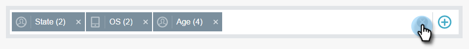
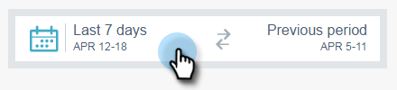

# 在[!UICONTROL Email Insights]中筛选 {#filtering-in-email-insights}

在[!UICONTROL Email Insights]中，有不同的方法来筛选您的数据。

## [!UICONTROL Email Insights] {#email-insights}

单击+开始添加过滤器。 添加任意所需数量。

如果同一类别中有多个过滤器，则将合并并显示数量。

如果您需要查看已应用哪些过滤器，只需单击该过滤器即可。 您甚至可以在其中添加更多内容。

您还可以添加其他类型的过滤器。

还有更多的过滤器！

在应用每个过滤器后，图表会发生变化。

要删除类别，请单击其X。

要清除所有筛选器，请单击筛选器栏末尾的X。

对于特定于日期的数据，请使用日期范围。

从常见的预设日期范围中进行选择，选择特定的日期，甚至可以使用上一时段进行比较。

>[!NOTE]
>
>日期范围同时适用于[!UICONTROL Analytics]页面和[!UICONTROL Sends]页面。 但是，**比较**&#x200B;选项仅适用于[!UICONTROL Analytics]页面。

## 基于帐户的营销 {#account-based-marketing}

如果您使用[[!UICONTROL Target Account Management]](https://docs.marketo.com/display/DOCS/Account+Based+Marketing+Overview)，则有专门为您设置的过滤器。

