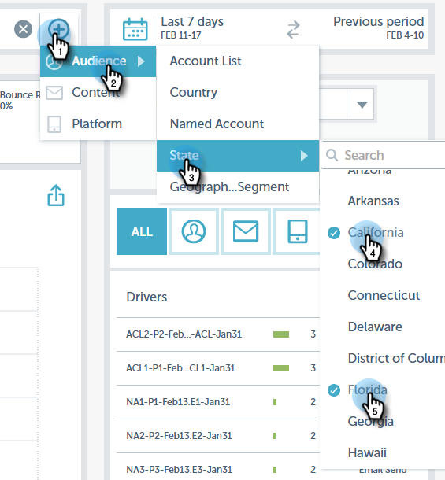

# 在电子邮件分析中过滤 {#filtering-in-email-insights}

在电子邮件分析中，有不同的方法可过滤您的数据。

## 电子邮件分析 {#email-insights}

单击+以开始添加过滤器。 根据需要添加任意数量。

如果同一类别中有多个过滤器，则它们将合并并显示相应数量。

如果您需要查看已应用的过滤器，只需单击该过滤器。 您甚至可以在此处添加更多内容。

您还可以添加其他类型的过滤器。

还有更多过滤器！

在应用每个过滤器后，图表会发生更改。

要删除类别，请单击其X。

要清除所有过滤器，请单击过滤器栏末尾的X。

对于特定于日期的数据，请使用日期范围。

从常用的预设日期范围中进行选择，选择特定日期，甚至使用上一期间进行比较。

>[!NOTE]
>
>日期范围适用于Analytics页面和“发送”页面。 的 **比较** 选项仅适用于Analytics页面。

## 基于帐户的营销 {#account-based-marketing}

如果您使用 [Target帐户管理](https://docs.marketo.com/display/DOCS/Account+Based+Marketing+Overview)，则有专门针对您的过滤器。

