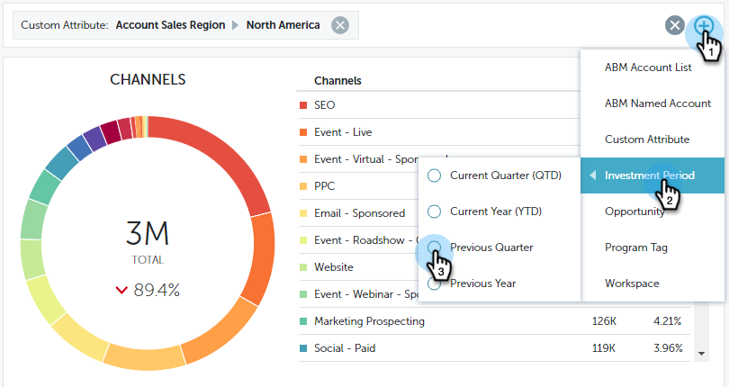

# 在性能分析中进行筛选 {#filtering-in-performance-insights}

轻松筛选数据以查询特定信息。

单击+开始添加过滤器。

>[!NOTE]
>
>目前，自定义属性在筛选器中仅适用于启用了收入周期分析的客户。

单击某个类别将显示多个子类别。

选择子类别并搜索/选择一个值。

图表会更新以反映所选过滤器。

您可以按照相同步骤添加其他过滤器。

您可以随时通过单击过滤器旁边的X来删除该过滤器。 单击最右侧的X可一次删除所有过滤器。

## 可用筛选器 {#available-filters}

<table> 
 <tbody> 
  <tr> 
   <td colspan="1"><strong>ABM帐户列表</strong></td> 
   <td colspan="1">如果您使用的是Marketo ABM，则所有帐户列表都将同步到MPI，并通过“ABM帐户列表”筛选器可见。 您可以选择帐户列表以筛选这些帐户的结果。<a href="https://docs.marketo.com/display/public/DOCS/Account-Based+Web+Marketing+with+ABM" rel="nofollow">了解有关ABM帐户列表的详细信息。</a></td> 
  </tr> 
  <tr> 
   <td colspan="1"><strong>ABM指定帐户</strong></td> 
   <td colspan="1">如果您使用的是Marketo ABM，则所有指定帐户都将同步到MPI，并通过“ABM指定帐户”筛选器可见。 您可以选择指定帐户来筛选这些帐户的结果。<a href="https://docs.marketo.com/x/eaCt" rel="nofollow">了解有关ABM指定帐户的更多信息。</a></td> 
  </tr> 
  <tr> 
   <td colspan="1"><strong>自定义属性</strong></td> 
   <td colspan="1">
这些由您决定。 所有字段 <a href="/help/marketo/product-docs/reporting/revenue-cycle-analytics/revenue-tools/enabling-custom-field-sync-for-revenue-cycle-analytics.md" rel="nofollow">您启用</a> 对于机会分析，可以在性能分析中进行过滤。
</td> 
  </tr> 
  <tr> 
   <td colspan="1">
<strong>投资期</strong>
</td> 
   <td colspan="1">
计划成本时间范围。
</td> 
  </tr> 
  <tr> 
   <td colspan="1">
<strong>机会类型</strong>
</td> 
   <td colspan="1">
在Salesforce (CRM)设置中的Opportunity对象上设置的Opportunity类型。
</td> 
  </tr> 
  <tr> 
   <td>
<strong>项目标记</strong>
</td> 
   <td>
标记用于描述程序。 您可以根据需要进行任意数量的更改，每个更改都有唯一值。 <a href="/help/marketo/product-docs/administration/tags/create-a-new-program-tag-and-tag-values.md" rel="nofollow">在此处了解如何使用项目标记。</a>
</td> 
  </tr> 
  <tr> 
   <td><strong>工作区</strong></td> 
   <td>
工作区是Marketo中用于存放营销资源的单独区域，例如：项目、登陆页面、电子邮件等。 <a href="/help/marketo/product-docs/administration/workspaces-and-person-partitions/understanding-workspaces-and-person-partitions.md" rel="nofollow">在此处了解有关工作区的更多信息。</a>
</td> 
  </tr> 
 </tbody> 
</table>

>[!NOTE]
>
>在参与仪表板中，只有项目标记和工作区过滤器可用。
