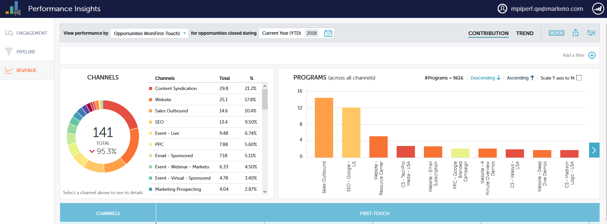
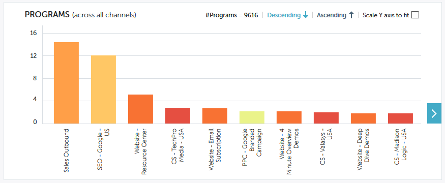

# 绩效分析贡献概述{#performance-insights-contribution-overview}

在Marketo Performance Insights中，默认情况下会显示贡献视图。

选择要视图性能的量度。 在此示例中，我们将在收入仪表板中查看通过多触赢得的机会。

>[!NOTE]
>
>了解[首次触控和多次触控](https://docs.marketo.com/display/DOCS/Understanding+Attribution)。

选择要查看量度的期间。 在此示例中，我们将查看当年（年初至今）。   

>[!NOTE]
>
>我们暂时删除了“上一年”选项。 您仍可以选择使用“自定义范围”选项来查看上一年的整个性能数据。

量度通过两个图表显示：甜甜圈和酒吧。   

圆环图显示所选量度的前十个渠道。

条形图显示了您所选量度的所有渠道(每次10个项目)的项目性能。 要查看更多内容，请单击右侧的箭头，滚动到下一个组。

>[!TIP]
>
>如果希望图形中的条在您滚动浏览组时向上缩放，请选中&#x200B;**缩放Y轴以适合**&#x200B;复选框。

将鼠标悬停在条上可查看其他详细信息。   

在圆环图中选择一个或多个渠道，与这些项目关联的所有渠道将显示在右侧的条形图中。 再次单击渠道可取消选择。

下面的数据网格的功能与电子表格类似，它显示所选归因模型（首次触摸/多触）下的所有可用量度。 包含所选量度的列将高亮显示。

| **赢得了机会** | 为影响赢得的机会而接收的项目的信用部分（以数值表示） |
|---|---|
| **赢取收入** | 为影响赢得的机会而收到的项目的信用部分（以货币价值计） |
| **成本** | 项目总成本 |
| **每个机会的成本** | 项目成本与项目为影响创造新机会而收到的信用部分（以数值表示）的比率 |
| **收益与成本比** | 为影响赢得的机会而收到的项目的信用部分（以货币价值计）与项目成本的比率 |

展开一个渠道，查看其前十个项目，其余项目加在一起。

>[!NOTE]
>
>在上面的甜甜圈图中，单击渠道激活/停用它旁边的复选框。

