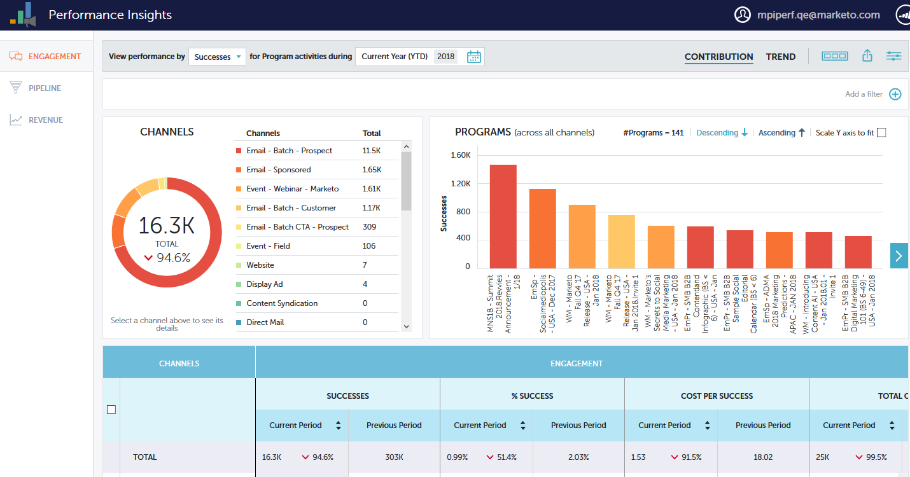

# 性能分析功能板 {#performance-insights-dashboards}

了解有关MPI中可用功能板的更多信息。

## 参与度 {#engagement}

“参与度”仪表板可帮助您衡量培养和新名称获取计划的有效性。

测量受众参与度

选择 **成功** 量度来衡量您的“培养计划”中的受众参与度。 在Marketo，成功是有意义互动的衡量标准。

项目的目的是与人员或潜在客户进行有意义的互动。 当人员达到达到该目标的状态时，即表示成功。 它可以参加网络研讨会，单击电子邮件中的链接，或填写Web表单。 成功情况因节目渠道而异。

>[!NOTE]
>
>在网络研讨会计划中，可以有多种状态，例如：已邀请、已注册并已出席。 “已邀请”或“已注册”并不是有意义的交互，因为用户实际上不会观看网络研讨会。 在这种情况下，已参加被视为成功。

测量新名称获取

选择 **新名称** 量度来衡量新名称获取计划的有效性。

>[!NOTE]
>
>必须设置您的所有程序以设置潜在客户的客户获取程序和客户获取日期，以便此仪表板为您提供最佳结果。

## 管道 {#pipeline}

“管道”功能板按首次联系和多次联系量度显示渠道性能。

<table> 
 <tbody> 
  <tr> 
   <td>
<strong>新机会</strong>
</td> 
   <td>
该方案因影响创造新机会而获得的部分信用。 如果涉及多个潜在客户，则可能只是一个零头。
</td> 
  </tr> 
  <tr> 
   <td>
<strong>已创建管道</strong>
</td> 
   <td>
为影响机会创造而收到的信贷（以货币价值计）部分。 如果涉及多个潜在客户，则可能占总数的一小部分。
</td> 
  </tr> 
  <tr> 
   <td>
<strong>管道打开</strong>
</td> 
   <td>
（以货币价值计）为影响创造仍然开放的机会而收到的方案的信用部分。 如果涉及多个潜在客户，则可能占总数的一小部分。
</td> 
  </tr> 
  <tr> 
   <td>
<strong>预期收入</strong>
</td> 
   <td>
为影响机会创造而收到的信贷（以货币价值计）部分。 预期收入是Opportunity概率乘以机会值。 如果涉及多个潜在客户，则可能只是一个零头。
</td> 
  </tr> 
  <tr> 
   <td>
<strong>每个机会创建的成本</strong>
</td> 
   <td>
影响新机会的方案成本的部分除以新机会的总数。
</td> 
  </tr> 
  <tr> 
   <td>
<strong>创建的管道与成本比</strong>
</td> 
   <td>
获得的用于影响创造新机会的方案的信用部分除以影响创造机会的方案成本部分。
</td> 
  </tr> 
 </tbody> 
</table>

## 收入 {#revenue}

“收入”功能板按首次联系和多次联系量度显示渠道性能。

<table> 
 <tbody> 
  <tr> 
   <td>
<strong>赢得的机会</strong>
</td> 
   <td>
为影响赢得的机会而接收的项目的信用部分。
</td> 
  </tr> 
  <tr> 
   <td>
<strong>收入赢得</strong>
</td> 
   <td>
为影响赢得的机会而收到的信用部分（货币价值）。
</td> 
  </tr> 
  <tr> 
   <td>
<strong>每个机会的成本</strong>
</td> 
   <td>
影响新机会的方案成本的部分除以新机会的总数。
</td> 
  </tr> 
  <tr> 
   <td>
<strong>收入胜出与成本比</strong>
</td> 
   <td>
用于影响成功机会的信用部分（货币价值）除以影响新机会的方案成本部分。
</td> 
  </tr> 
 </tbody> 
</table>
